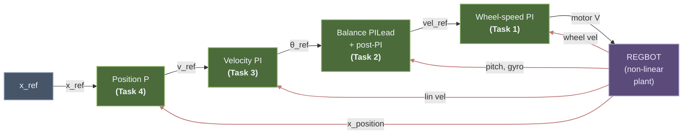

# REGBOT Balance Assignment

Cascaded four-loop control for the REGBOT self-balancing two-wheel robot. Each loop is designed with the frequency-domain phase-balance method, verified in Simulink on the non-linear Simscape Multibody model, and validated on the physical robot.

> [!example] Related Materials
> - [[Lesson 10 - Unstable Systems and REGBOT Balance]] — unstable-system theory + Nyquist primer (local copy)
> - [Lecture 10 Slides](obsidian://open?vault=Obsidian&file=Courses%2F34722%20Linear%20Control%20Design%201%2FSlides%2FLecture_10_Unstable_systems.pdf) *(opens in the DTU vault)*
> - [Fundamentals Guide](obsidian://open?vault=Obsidian&file=Courses%2F34722%20Linear%20Control%20Design%201%2FLecture%20Notes%2FFundamentals%20-%20Intuitive%20Control%20Theory) *(opens in the DTU vault)*
> - [Worked Example – REGBOT Position Controller](obsidian://open?vault=Obsidian&file=Courses%2F34722%20Linear%20Control%20Design%201%2FLecture%20Notes%2FWorked%20Example%20-%20REGBOT%20Position%20Controller) *(opens in the DTU vault)*
> - [Day 5 – Black Box Modeling](obsidian://open?vault=Obsidian&file=Courses%2F34722%20Linear%20Control%20Design%201%2FExercises%2FWork%2FDay%205%20-%20Black%20Box%20Modeling) — voltage-to-velocity identification *(DTU vault)*
> - [Day 8 & 9 – Position Controller Design](obsidian://open?vault=Obsidian&file=Courses%2F34722%20Linear%20Control%20Design%201%2FExercises%2FWork%2FDay%208%20%26%209%20-%20Position%20Controller%20Design) *(DTU vault)*

---

## Cascade architecture



Each outer loop is at least ${\sim}5\times$ slower than the one inside it, so the outer loop sees the inner loop as an approximately instantaneous unity gain. Red arrows are measurement feedbacks.

### Simulink implementation

![[regbot_simulink_model.png]]
*Top-level Simulink model (`regbot_1mg.slx`). Left to right: position-loop gain $K_{ppos}$, Velocity PI, $K_{pvel}$, `Tilt_Controller` subsystem (Task 2 — see Step 3 below), Wheel-velocity controller (Task 1) with $K_{pwv}$, integrator, and feed-forward branch, $\pm 9$ V limiter, and the `robot with balance` Simscape Multibody plant. The Disturbance block feeds a configurable 1 N / 0.1 s push into `desturb_force` for the Task 2 push-rejection test. Measured wheel velocity comes back through `wheel_vel_filter = 1/(twvlp\,s + 1)` to both the Task 1 error sum and the Task 3 (Velocity PI) outer error sum; pitch, gyro, and `x_position` tap directly from the robot block.*

---

## MATLAB design workflow

Four scripts in `simulink/`, run in order. Each one:

1. Loads the parameter + committed-gains workspace via `regbot_mg`.
2. Linearises the Simulink model at the right break point — previous loops closed, this one open. (Task 1 is the exception: it uses the Day 5 on-floor plant directly from the MAT file, no Simulink linearisation.)
3. Runs the phase-balance derivation, prints every intermediate value, saves plots into `docs/images/`.
4. Prints a copy-paste gains block. **Paste that back into `regbot_mg.m` before running the next script** — the next script linearises with the freshly designed gains active.

| # | Script | Relies on | Produces |
|---|---|---|---|
| 1 | `design_task1_wheel` | `data/Day5_results_v2.mat` (variable `G_1p_avg`) | $K_{pwv}$, $\tau_{iwv}$; `regbot_task1_{bode,step}.png` |
| 2 | `design_task2_balance` | Task 1 gains active | $K_{ptilt}$, $\tau_{itilt}$, $\tau_{dtilt}$, $\tau_{ipost}$; `regbot_Gtilt_*`, `regbot_task2_*` |
| 3 | `design_task3_velocity` | Tasks 1 + 2 active | $K_{pvel}$, $\tau_{ivel}$; `regbot_task3_*` |
| 4 | `design_task4_position` | Tasks 1 + 2 + 3 active | $K_{ppos}$, $\tau_{dpos}$; `regbot_task4_*` |

Output folder is resolved by `simulink/lib/pick_image_dir.m` → always `docs/images/`.

---

## Inner plant — Day 5 on-floor identification

Voltage-to-wheel-velocity plant identified from a 1-pole `tfest` fit on Day 5 on-floor training-wheels data (variable `G_1p_avg` in `data/Day5_results_v2.mat`):

$$G_{vel}(s) \;=\; \frac{2.198}{s + 5.985}$$

DC gain $0.367\,\mathrm{(m/s)/V}$, single pole at $-5.985$ rad/s ($\tau = 167$ ms). This is the operating regime the outer loops will see during the assignment missions.

See the _Day 5 redesign_ note at the bottom for why on-floor identification was used in preference to a wheels-up one.

---

## Task 1 — Wheel-speed PI

> [!tldr]+ Task 1 summary
> **Purpose.** Design the innermost controller of the cascade — a PI that turns a velocity reference into motor voltage. This is the fastest loop, so everything outside it can later treat it as an approximately instantaneous unity gain. That is the whole reason the cascaded design works: once Task 1 is closed, Task 2 can ignore the voltage-to-velocity dynamics and design directly in the tilt channel.
> **What this section shows.** The Day 5 on-floor plant $G_{vel}(s) = 2.198/(s+5.985)$, the phase-balance calculation at the chosen $\omega_c = 30$ rad/s (plant $-78.7°$, PI $-18.4°$ → natural $\gamma_M = 82.9°$, so no Lead is needed), and the single $K_p$ solve that puts $|L(j\omega_c)| = 1$. Bode and closed-loop step plots confirm the derivation.
> **Result.** $K_p = 13.2037$, $\tau_i = 0.100$ s. Achieved $\omega_c = 30.00$ rad/s, $\gamma_M = 82.85°$, $GM = \infty$.
> **How Task 2 uses it.** Paste the gains into `regbot_mg.m` and run `design_task2_balance`. That script opens `regbot_1mg.slx` with these Task 1 values in the workspace and calls `linearize` from `vel_ref` to the tilt-angle output — the closed Task 1 loop is precisely what makes the resulting $G_{tilt}$ a plant the balance controller can meaningfully design against.

`design_task1_wheel`

### What this loop does

Task 1 is the **innermost** and **fastest** loop: $\omega_c = 30$ rad/s, $\geq 2\times$ Task 2 and $\geq 30\times$ Task 3. That spread is what makes the cascade work — every outer loop can treat Task 1 as an instantaneous unity gain because it settles well within one sample of the next layer. ["Design inner loops first"](obsidian://open?vault=Obsidian&file=Courses%2F34722%20Linear%20Control%20Design%201%2FLecture%20Notes%2FLesson%2010%20-%20Unstable%20Systems%20and%20REGBOT%20Balance) is a direct consequence of this bandwidth separation, not a stylistic preference.

Controller choice: **PI**. The plant $G_{vel}(s) = 2.198/(s+5.985)$ is **Type-0** (plain first-order lag, no integrator), so a P-controller would leave $e_{ss} = 1/(1 + K_p K_{DC}) \neq 0$ on a step (worked through in [Fundamentals §10.1](obsidian://open?vault=Obsidian&file=Courses%2F34722%20Linear%20Control%20Design%201%2FLecture%20Notes%2FFundamentals%20-%20Intuitive%20Control%20Theory)). The PI's integrator lifts the loop to Type-1 and drives $e_{ss} \to 0$. No Lead — Step 2 shows the plain PI already clears $\gamma_M = 60°$ with ${>}20°$ to spare, so a Lead would only amplify noise for no phase-margin benefit.

### The plant

$$G_{vel}(s) \;=\; \frac{2.198}{s + 5.985}$$

A single-pole first-order lag. Reading off the features:

- **DC gain** $K_{DC} = 2.198/5.985 = 0.367$ (m/s)/V — every volt produces $0.367$ m/s at steady state.
- **Time constant** $\tau = 1/5.985 = 0.167$ s — the motor reaches $63.2\%$ of its final speed in ${\sim}167$ ms.
- **Break frequency** $\omega_b = 5.985$ rad/s — below this, the plant is essentially a constant gain of $0.367$; above, the magnitude rolls off at $-20$ dB/decade and the phase slides from $0°$ toward $-90°$ (passing $-45°$ exactly at $\omega_b$).

Design-relevant: at our target $\omega_c = 30$ rad/s (a factor of $5$ above $\omega_b$), the plant already behaves like an integrator — phase close to $-90°$, magnitude on a clean $-20$ dB/dec slope. This is a "nice" plant in the Lesson 9 sense, which is why a plain PI with $N_i = 3$ clears the PM spec without breaking a sweat.

### Specifications, translated to the frequency domain

| Spec | Value | What it means |
|---|---|---|
| Crossover $\omega_c$ | $30$ rad/s | Closed-loop bandwidth knob. Set $\geq 2\times$ Task 2's $15$ rad/s so Task 2 sees Task 1 as instant. |
| Phase margin $\gamma_M$ | $\geq 60°$ | Course default — maps to $\zeta \approx 0.6$, ${\sim}10\%$ step overshoot. See [Fundamentals §7.3](obsidian://open?vault=Obsidian&file=Courses%2F34722%20Linear%20Control%20Design%201%2FLecture%20Notes%2FFundamentals%20-%20Intuitive%20Control%20Theory). |
| $N_i$ | $3$ | PI zero placement: $\tau_i = N_i/\omega_c$. Course minimum; trade-off in Step 1. |

### Step 1 — Place the PI zero at $\omega_c/N_i$

**What we do.** Compute the integral time constant and write down the PI shape (no gain yet):

$$\tau_i \;=\; \frac{N_i}{\omega_c} \;=\; \frac{3}{30} \;=\; 0.100 \text{ s}
\qquad\Longrightarrow\qquad
C_{PI,\text{shape}}(s) \;=\; \frac{\tau_i s + 1}{\tau_i s}$$

**Bode meaning.** PI = pole at origin + zero at $1/\tau_i = 10$ rad/s. Below the zero the PI is a pure integrator ($-20$ dB/dec slope, phase $-90°$); above it, the zero cancels the integrator's slope and the PI flattens ($0$ dB/dec, phase climbing back to $0°$). The **aha**: the zero is what *recovers* the phase the integrator stole, before we reach $\omega_c$.

At $\omega_c = 30$ (three times above the zero), $\phi_{PI} = \arctan(\omega_c\tau_i) - 90° = \arctan(3) - 90° = -18.43°$ — most of the $-90°$ already paid back.

**Why $N_i = 3$ and not $1$ or $10$.** This is the core trade-off for the PI zero (see [Lesson 9 §4.1](obsidian://open?vault=Obsidian&file=Courses%2F34722%20Linear%20Control%20Design%201%2FLecture%20Notes%2FLesson%209%20-%20PI-Lead%20Design%20with%20Specifications) and [Fundamentals §10.5.1](obsidian://open?vault=Obsidian&file=Courses%2F34722%20Linear%20Control%20Design%201%2FLecture%20Notes%2FFundamentals%20-%20Intuitive%20Control%20Theory)). The PI phase at $\omega_c$ is $\phi_{PI} = \arctan(N_i) - 90°$:

| $N_i$ | PI zero position | $\phi_{PI}$ at $\omega_c$ | Trade-off |
|---|---|---|---|
| $1$ | at $\omega_c$ | $-45°$ | Strong integral action right at $\omega_c$, but costs $45°$ of phase margin — eats into your budget. |
| $3$ | one-third of $\omega_c$ | $-18.4°$ | Course default — meaningful integral action through a decade below $\omega_c$, with a manageable phase cost. |
| $10$ | one-tenth of $\omega_c$ | $-5.7°$ | Almost-free phase-wise, but the integrator only kicks in at very low frequencies — the loop is slow to zero out disturbances. |

$N_i = 3$ is the sweet spot and the course's cookbook choice. Unless the plant's own phase at $\omega_c$ leaves you with no budget (see Task 2), start with $N_i = 3$ and only revisit it if the phase balance doesn't close.

**In MATLAB.** `design_task1_wheel.m` lines 60–66:

```matlab
wc_wv        = 30;       % target crossover [rad/s]
gamma_M_spec = 60;       % phase margin spec [deg]
Ni_wv        = 3;        % PI zero at wc/Ni

tau_i_wv     = Ni_wv / wc_wv;                      % = 0.1 s
C_wv_shape   = (tau_i_wv*s + 1) / (tau_i_wv*s);    % PI shape, no gain yet
```

This is just the formula typed out — there is nothing hidden. The script prints `tau_i = Ni/wc = 0.1000 s`; in Bode-plot terms, that fixes the PI zero at $1/\tau_i = 10$ rad/s.

### Step 2 — Phase balance: do we need a Lead?

**What we do.** Before computing a gain, check whether $C_{PI,\text{shape}} \cdot G_{vel}$ already clears the $60°$ phase-margin spec at our target $\omega_c$. If yes, no Lead is needed; if no, the Lead must close the phase gap. This is the **phase-balance equation** at the heart of the design procedure ([Fundamentals §10.8](obsidian://open?vault=Obsidian&file=Courses%2F34722%20Linear%20Control%20Design%201%2FLecture%20Notes%2FFundamentals%20-%20Intuitive%20Control%20Theory), [Lesson 9 §3](obsidian://open?vault=Obsidian&file=Courses%2F34722%20Linear%20Control%20Design%201%2FLecture%20Notes%2FLesson%209%20-%20PI-Lead%20Design%20with%20Specifications)):

$$\gamma_M - 180° \;=\; \angle G_{vel}(j\omega_c) + \phi_{PI} + \phi_{Lead}
\qquad\Longrightarrow\qquad
\phi_{Lead} \;=\; (\gamma_M - 180°) - \angle G_{vel}(j\omega_c) - \phi_{PI}$$

**Plug in the numbers at $\omega_c = 30$:**

| Term | Value |
|---|---|
| $\angle G_{vel}(j30) = -\arctan(30/5.985)$ | $-78.71°$ |
| $\phi_{PI} = \arctan(3) - 90°$ (from Step 1) | $-18.43°$ |
| Total open-loop phase | $-97.14°$ |
| Natural $\gamma_M = 180° + (-97.14°)$ | $+82.86°$ ✓ |
| Required $\phi_{Lead}$ for exactly $60°$ PM | $-22.86°$ (negative!) |

A *negative* required Lead phase means plant+PI already exceed the spec. A Lead would push $\gamma_M$ higher, but it also amplifies noise through its zero — no reason to add it. **No Lead.**

**The aha.** A first-order lag can never exceed $-90°$ of phase (asymptotic limit). The PI adds a pole at origin ($-90°$), but its zero at $\omega_c/N_i$ recovers most of that before $\omega_c$. So the total sits near $-97°$ — nowhere near the $-180°$ stability line. First-order plant + PI is almost always "phase-free" at $\omega_c$; you only reach for Lead when the plant itself has higher-order phase lag (Task 2's pendulum, Task 4's 11th-order position plant).

`design_task1_wheel.m` skips this step explicitly and goes straight to the gain solve — the author knew first-order + PI at $N_i = 3$ lands PM comfortably. `margin(L_wv)` in Step 4 confirms it after the fact.

### Step 3 — Solve $K_p$ so $|L(j\omega_c)| = 1$

**What we do.** Pick the gain $K_p$ that forces the open-loop magnitude to exactly $1$ (i.e. $0$ dB) at the chosen $\omega_c$. The crossover $\omega_c$ is *defined* as the frequency where $|L(j\omega)| = 1$, so we engineer it by scaling:

$$|L(j\omega_c)| \;=\; K_p \cdot |C_{PI,\text{shape}}(j\omega_c)| \cdot |G_{vel}(j\omega_c)| \;=\; 1
\qquad\Longrightarrow\qquad
K_p \;=\; \frac{1}{\left|C_{PI,\text{shape}} \cdot G_{vel}\right|_{j\omega_c}}$$

**Plug in the numbers:** $|C_{PI,\text{shape}}(j30)| = \sqrt{10}/3 = 1.054$, $|G_{vel}(j30)| = 2.198/\sqrt{900 + 35.82} = 0.0719$. Product $= 0.0758$, so $K_p = 1/0.0758 = 13.2037$.

**The aha.** At $\omega_c$, the unscaled loop magnitude sits $20\log_{10}(0.0758) = -22.4$ dB below the $0$ dB line. $K_p$ is pure gain — flat across frequency ([Fundamentals §10.1](obsidian://open?vault=Obsidian&file=Courses%2F34722%20Linear%20Control%20Design%201%2FLecture%20Notes%2FFundamentals%20-%20Intuitive%20Control%20Theory)) — so it lifts the whole magnitude curve uniformly, and $K_p = 13.2$ is exactly whatever lifts it by $22.4$ dB to park $\omega_c$ at $0$ dB. Step 2's phase doesn't move, so $\gamma_M = 82.86°$ falls out automatically.

Physically: $K_p = 13.2$ V per (m/s) means "pipe $13.2$ V *instantly* into the motor per m/s of velocity error." The integral term $K_p/\tau_i = 132$ V per (m/s·s) on top accumulates the steady-state correction.

**In MATLAB** (`design_task1_wheel.m` lines 68–73):

```matlab
magL_wc = squeeze(bode(C_wv_shape * Gvel_day5, wc_wv));
Kp_wv   = 1 / magL_wc;
C_wv    = Kp_wv * C_wv_shape;
L_wv    = C_wv * Gvel_day5;
```

`bode(..., wc_wv)` at a single frequency returns the unscaled loop magnitude at that frequency; reciprocal is the gain solve. That's it.

### The full controller

$$\boxed{\;C_{wv}(s) \;=\; 13.2037 \cdot \frac{0.1\,s + 1}{0.1\,s}\;}$$

Equivalently $K_p = 13.2037$ and $K_i = K_p/\tau_i = 132.037$ — the controller outputs $13.2\,e + 132\int e\,dt$ in units of volts per (m/s) and volts per (m/s·s), summed.

### Step 4 — Verification

From `margin(L_wv)`: $\omega_c = 30.00$ rad/s, $\gamma_M = 82.85°$, $GM = \infty$. All three numbers match Step 2's hand calculation.

![[regbot_task1_bode.png]]
*Open-loop Bode $L_{wv} = C_{wv}\,G_{vel}$. Title: $Gm = \infty$, $Pm = 82.8°$ at $30$ rad/s.*

> [!tip]+ How to read the Bode plot
> Top panel: magnitude (dB), bottom: phase (deg), both vs. $\log\omega$. `margin()` finds the $0$ dB crossing (= $\omega_c$), reads the phase there, and reports $180° + \phi$. Below $\omega_c$: magnitude rises on $-20$ dB/dec — the PI integrator dominating, which is what gives the infinite DC gain (Type-1 loop → $e_{ss} = 0$). Above $\omega_c$: magnitude keeps dropping on $-20$ dB/dec, now just the plant pole rolling off. The phase asymptotes toward $-180°$ (integrator $-90°$ + fully-developed plant $-90°$) but *never crosses* on first-order plant + PI — so `margin` reports $Gm = \infty$.

![[regbot_task1_step.png]]
*Closed-loop step response: $T = L/(1+L)$ to a unit reference at $t = 0$.*

> [!tip]+ How to read the step response
> Rise time ${\sim}75$ ms matches the first-order approximation $\tau_{cl} \approx 2.2/\omega_c \approx 73$ ms. Overshoot ${\sim}4\%$ is well below the ${\sim}10\%$ a $60°$ PM would give — our actual $82.85°$ PM is close to critically damped. Settles to $1.0$ by $t \approx 0.3$ s with zero steady-state error, as the Type-1 loop guarantees ([Fundamentals §11.2](obsidian://open?vault=Obsidian&file=Courses%2F34722%20Linear%20Control%20Design%201%2FLecture%20Notes%2FFundamentals%20-%20Intuitive%20Control%20Theory)).

### How Task 2 uses this

With Task 1 gains in `regbot_mg.m`, `design_task2_balance` linearises the Simulink model from `vel_ref` → tilt *with the Task 1 loop active*, producing $G_{tilt}(s)$ — the 7th-order plant the balance controller designs against. That plant is only meaningful *because* Task 1 is closed; otherwise the inner voltage-to-velocity dynamics would appear as extra fast modes in $G_{tilt}$. Standard [Lesson 10 §6.2](obsidian://open?vault=Obsidian&file=Courses%2F34722%20Linear%20Control%20Design%201%2FLecture%20Notes%2FLesson%2010%20-%20Unstable%20Systems%20and%20REGBOT%20Balance) pattern: freeze the inner loop, linearise around it, design the next layer.

Paste into `regbot_mg.m`:

```matlab
Kpwv  = 13.2037;
tiwv  = 0.1000;
Kffwv = 0;
```

---

## Task 2 — Balance (Lecture 10 Method 2)

> [!tldr]+ Task 2 summary
> **Purpose.** Stabilise the inverted-pendulum tilt dynamics. With Task 1 closed, linearising `vel_ref → tilt angle` gives a 7th-order plant with $P = 1$ RHP pole at $+9.13$ rad/s — this is the "falling" mode of the pendulum. A plain PI-Lead can't stabilise this (Nyquist won't encircle $-1$ in the correct direction), so the design follows Lecture 10 **Method 2**.
> **What this section shows.** The four-step Method 2 recipe worked through end-to-end:
> 1. **Sign check.** DC gain $> 0$ with $P = 1$ forces a CCW Nyquist encirclement requirement. No positive-gain controller can produce it, so a $-1$ is bundled into the post-integrator.
> 2. **Post-integrator.** Its zero is placed at the magnitude peak of $|G_{tilt}|$ ($\omega_\text{peak} = 8.17$ rad/s → $\tau_{i,\text{post}} = 0.1224$ s). After this, $G_{tilt,\text{post}} = -C_{PI,\text{post}}\,G_{tilt}$ has a monotonically decreasing magnitude — a standard outer loop can now be designed on it.
> 3. **Outer PI-Lead on $G_{tilt,\text{post}}$** at $\omega_c = 15$ rad/s, $\gamma_M = 60°$, $N_i = 3$. PI zero $\tau_i = 0.200$ s. Phase balance wants $+34.25°$ of Lead, realised cheaply through the gyro ($\tau_d \dot\theta + \theta$ is a free ideal $(\tau_d s + 1)$ Lead) → $\tau_d = 0.0454$ s. Loop-gain solve gives $K_P = 1.1871$.
> 4. **Verification.** `margin(L_tilt)` reports $\omega_c = 15.00$ rad/s, $\gamma_M = 60.00°$, $GM = -5.44$ dB (a **lower** bound on $|K|$ for $P = 1$ plants — the negative sign is the normal signature of an unstable-plant design, not a bug), $0$ RHP closed-loop poles.
> **Result.** $K_p = 1.1871$, $\tau_i = 0.200$, $\tau_d = 0.0454$, $\tau_{i,\text{post}} = 0.1224$. **Firmware `[cbal] kp` is entered negative** — the firmware Balance block does not absorb the Method 2 sign flip internally; a positive `kp` produces a positive-feedback runaway (hard-won finding from the first campaign).
> **How Task 3 uses it.** Paste the gains, then run `design_task3_velocity`. That script re-linearises the Simulink model with both Tasks 1 and 2 closed and takes the output from `Kpvel_gain` (which produces $\theta_\text{ref}$) to wheel velocity. Because the balance loop has just stabilised the pendulum mode, the resulting $G_{vel,\text{outer}}$ has $0$ RHP poles — Task 3 designs against a stable plant (apart from an RHP *zero*, which is physics-level and can't be controlled away).

`design_task2_balance`

### What this loop does

Task 2 stabilises the inverted pendulum — the "keep the broomstick upright" loop. With Task 1 closed, `linearize` from `vel_ref` → tilt angle produces a 7th-order plant $G_{tilt}(s)$ with **one RHP pole at $+9.13$ rad/s** — the pendulum's falling mode. That pole is the plant literally trying to escape: without feedback, the tilt error grows like $e^{9.13\,t}$ ([Lesson 10 §1](obsidian://open?vault=Obsidian&file=Courses%2F34722%20Linear%20Control%20Design%201%2FLecture%20Notes%2FLesson%2010%20-%20Unstable%20Systems%20and%20REGBOT%20Balance)). A plain PI-Lead cannot stabilise this — the Nyquist curve won't encircle $(-1, 0)$ in the right direction (Step 1 below). So the design follows [Lecture 10 Method 2](obsidian://open?vault=Obsidian&file=Courses%2F34722%20Linear%20Control%20Design%201%2FLecture%20Notes%2FLesson%2010%20-%20Unstable%20Systems%20and%20REGBOT%20Balance): absorb a sign flip into a post-integrator that reshapes the plant's magnitude, then design a standard PI-Lead on top.

**Why Method 2 over Method 1?** Both stabilise the plant, but Method 1 closes an inner P loop and designs the outer controller on $K_{PS}G/(1 + K_{PS}G)$ — which hides the pendulum resonance and phase behaviour inside the closed-loop denominator. Method 2 absorbs *only the sign*, keeping the raw physics visible: the magnitude peak at $\omega \approx 8$ rad/s (pendulum resonance) is *the* feature that tells us where to place the post-integrator zero. For an inverted-pendulum design, Method 2 is almost always the right choice ([Lesson 10 §5.3](obsidian://open?vault=Obsidian&file=Courses%2F34722%20Linear%20Control%20Design%201%2FLecture%20Notes%2FLesson%2010%20-%20Unstable%20Systems%20and%20REGBOT%20Balance)).

### The plant

With Task 1 closed, `linearize` on `vel_ref → tilt angle` gives a 7th-order open-loop-unstable $G_{tilt}(s)$:

![[regbot_Gtilt_pzmap_zoom.png]]
*$G_{tilt}$ pole-zero map (zoomed to $\pm 50$ rad/s). Orange ring: RHP pole at ${\approx}+9.13$ rad/s — the inverted-pendulum falling mode. Complex LHP pair near $-8\pm 3j$ and zeros at $\pm 8$ reflect the non-minimum-phase geometry.*

Key features:

- **RHP pole at $+9.13$ rad/s** — the falling mode. $P = 1$ for Nyquist bookkeeping.
- **Complex LHP pair near $-8 \pm 3j$** — a lightly-damped oscillatory mode that shows up as a magnitude peak near $\omega = 8$ rad/s on the Bode plot.
- **RHP zero at $+8$ rad/s** — non-minimum-phase. To push the body upright, the wheels must briefly move the *wrong way*; this shows up as an initial undershoot in the step / IC response.
- **DC gain** $+4.83 \times 10^{-4}$ rad/(m/s) — the *sign* matters for Step 1.

### Specifications, translated to the frequency domain

| Spec | Value | What it means |
|---|---|---|
| Crossover $\omega_c$ | $15$ rad/s | Above the pendulum resonance at $\omega_\text{peak} \approx 8$ rad/s, so the loop rolls the resonance off — but at least $15\times$ slower than Task 3's $1$ rad/s budget, which is what a stable cascade needs. |
| Phase margin $\gamma_M$ | $\geq 60°$ | Course default. Task 2 clears this *exactly* at $60.00°$ — the Lead is sized to fill precisely the phase deficit. |
| $N_i$ | $3$ | Same as Task 1. PI zero at $\omega_c/3 = 5$ rad/s. |

Method 2 is four steps: **sign flip → post-integrator → outer PI-Lead → verify**.

### Step 1 — Nyquist sign check

**What we do.** Use the plant's DC-gain sign and RHP-pole count to pin down the sign of $K_{PS}$ (the stabilising loop gain). This is the Nyquist bookkeeping from [Lesson 10 §2.3/§3](obsidian://open?vault=Obsidian&file=Courses%2F34722%20Linear%20Control%20Design%201%2FLecture%20Notes%2FLesson%2010%20-%20Unstable%20Systems%20and%20REGBOT%20Balance):

$$Z \;=\; N + P$$

$Z$ = closed-loop RHP poles (want $0$); $N$ = net **CW** encirclements of $(-1, 0)$; $P$ = open-loop RHP poles. For $G_{tilt}$, $P = 1$, so we need $N = -1$ — exactly **one CCW** encirclement of $(-1, 0)$.

**The sign-of-$K_{PS}$ question.** A positive $K_{PS}$ only scales the Nyquist curve radially about the origin — it cannot change the winding direction. With DC gain $> 0$, the Nyquist curve starts out on the positive real axis heading rightward, and no amount of positive scaling drags it CCW around $(-1, 0)$. **Therefore sign($K_{PS}$) = $-1$**: a negative gain *flips* the curve through the origin (adds $180°$ rotation), which turns the would-be CW encirclement into a CCW one. That minus sign gets absorbed into the post-integrator in Step 2.

**The aha.** "Stabilising an unstable plant" in the complex plane means dragging the closed-loop pole from RHP to LHP — and that's precisely what a CCW encirclement of $(-1)$ produces. The Nyquist curve's starting direction (set by the DC-gain sign) decides whether positive gain alone can achieve this; for REGBOT it can't, so the sign flip is *forced*, not chosen.

**In MATLAB** (lines 99–117). Script grids $\omega \in [10^{-2}, 10^4]$ rad/s, reads `dcgain(Gtilt) = +4.83e-4`, and because `dc > 0` sets `sign_K = -1`. Prints `"DC gain > 0 AND P = 1 => need sign(K_PS) = -1"`.

### Step 2 — Post-integrator

**What we do.** Place a PI zero at the frequency where $|G_{tilt}(j\omega)|$ peaks. This does two things at once: it *reshapes* the magnitude curve to decrease monotonically beyond the peak, and (with the sign flip from Step 1) produces the one CCW Nyquist encirclement of $(-1)$ that stabilises the loop.

**Find the peak.** Script evaluates $|G_{tilt}|$ on a log grid and picks the max:

| Quantity | Value |
|---|---|
| $\omega_\text{peak}$ | $8.170$ rad/s |
| $|G_{tilt}(j\omega_\text{peak})|$ | $0.7068$ |

**Build the post-integrator.** Set $\tau_{i,\text{post}} = 1/\omega_\text{peak}$ so the PI zero lands right on the peak:

$$\tau_{i,\text{post}} \;=\; \frac{1}{\omega_\text{peak}} \;=\; 0.1224\,\mathrm{s},
\qquad
C_{PI,\text{post}}(s) \;=\; \frac{\tau_{i,\text{post}}\,s + 1}{\tau_{i,\text{post}}\,s},
\qquad
G_{tilt,\text{post}}(s) \;=\; -\,C_{PI,\text{post}}(s)\,G_{tilt}(s).$$

The minus sign is the sign flip from Step 1.

![[regbot_task2_bode_post.png]]
*$G_{tilt}$ (blue) vs $G_{tilt,\text{post}}$ (orange). Placing the PI zero at the magnitude peak flattens it and forces a monotonic roll-off beyond.*

> [!tip]+ How to read this Bode plot
> Blue curve ($G_{tilt}$) has a hump near $\omega = 8$ rad/s — the resonance from the LHP pair at $-8 \pm 3j$. Orange curve ($G_{tilt,\text{post}}$) is flat-then-falling through the same region. What happened: the PI zero at $1/\tau_{i,\text{post}} = 8.17$ rad/s adds $+20$ dB/dec slope above itself, which cancels the $+20$ dB/dec rise into the resonance. Past the peak, the integrator's $-20$ dB/dec takes over and the magnitude rolls off monotonically. This is the precondition the outer PI-Lead design needs — a plant with no hills.

![[regbot_task2_nyquist_post.png]]
*Nyquist of $G_{tilt,\text{post}}$. One CCW encirclement of $(-1, 0)$.*

> [!tip]+ How to read this Nyquist plot
> The curve wraps once *counter-clockwise* around the critical point $(-1, 0)$ — that's $N = -1$. With $P = 1$ open-loop RHP pole, $Z = N + P = 0$: zero closed-loop RHP poles, i.e. the post-integrated plant is stabilisable by any well-behaved outer controller. Without the sign flip from Step 1, the curve would wind *clockwise* instead, giving $Z = 2$ and making the closed loop worse than the open one.

**The aha.** The post-integrator's integrator isn't about zero steady-state error (though it does lift $G_{tilt,\text{post}}$ to Type-1). Its real job is *magnitude reshaping*: placing the zero at $\omega_\text{peak}$ cancels the rising slope just below the peak so the integrator's $-20$ dB/dec can dominate immediately after. Combined with the sign flip, it also produces the required CCW encirclement. Two birds, one PI.

**In MATLAB** (lines 120–147). `[mag_peak, k_peak] = max(mag_g)` finds the peak, `tau_ip = 1/w_grid(k_peak)`, and `Gtilt_post = sign_K * C_PI_post * Gtilt` assembles the sign-flipped stabilised plant.

### Step 3 — Outer PI-Lead on $G_{tilt,\text{post}}$

Now design a normal PI-Lead on the well-behaved $G_{tilt,\text{post}}$ — same phase-balance recipe as Task 1.

**PI zero:** $\tau_i = N_i/\omega_c = 3/15 = 0.200$ s.

**Phase balance at $\omega_c = 15$ rad/s:**

| Term | Value | Where it comes from |
|---|---|---|
| $\angle G_{tilt,\text{post}}(j15)$ | $-135.81°$ | 7th-order plant — phase has accumulated heavily by $\omega = 15$ |
| $\phi_{PI} = \arctan(3) - 90°$ | $-18.43°$ | Same as Task 1 — standard $N_i = 3$ cost |
| $\phi_\text{Lead}$ required | $+34.25°$ | $(60° - 180°) - (-135.81°) - (-18.43°) = +34.25°$ |

Unlike Task 1's negative required Lead (meaning no Lead), Task 2 needs a **substantial positive boost** — the plant's higher-order phase accumulation has to be fought off at $\omega_c$.

**The gyro shortcut.** A standard Lead $(\tau_d s + 1)/(\alpha\tau_d s + 1)$ needs an $\alpha < 1$ filter pole to keep noise amplification from an ideal differentiator finite ([Fundamentals §10.3](obsidian://open?vault=Obsidian&file=Courses%2F34722%20Linear%20Control%20Design%201%2FLecture%20Notes%2FFundamentals%20-%20Intuitive%20Control%20Theory)). But REGBOT's gyro **directly measures** $\dot\theta$. That lets us implement:

$$\tau_d \cdot \dot\theta + \theta \;=\; (\tau_d s + 1)\,\theta$$

which is an *ideal* Lead $(\tau_d s + 1)$ with no filter pole at all — the gyro is a pre-existing clean derivative, so no numerical differentiation is needed and the noise doesn't blow up ([Lesson 10 §7.3](obsidian://open?vault=Obsidian&file=Courses%2F34722%20Linear%20Control%20Design%201%2FLecture%20Notes%2FLesson%2010%20-%20Unstable%20Systems%20and%20REGBOT%20Balance)). **The aha:** this is free phase margin. Any non-REGBOT plant would pay extra phase lag from the $\alpha$-filter; we skip it entirely.

From $\phi_\text{Lead} = +34.25°$ at $\omega_c = 15$:

$$\tau_d \;=\; \frac{\tan 34.25°}{15} \;=\; 0.0454\,\mathrm{s}$$

**Gain from $|L(j\omega_c)| = 1$:** $|C_{PI}\,C_\text{Lead}\,G_{tilt,\text{post}}|(j15) = 0.8424$ → $K_p = 1/0.8424 = 1.1871$.

$$\boxed{\;C_\text{tilt}(s) \;=\; -\,1.1871 \cdot \frac{0.1224\,s + 1}{0.1224\,s} \cdot \frac{0.2\,s + 1}{0.2\,s} \cdot (0.0454\,s + 1)\;}$$

![[regbot_simulink_tilt_controller.png]]
*Simulink wiring of `Tilt_Controller`. Inputs: pitch (port 1), gyro (port 2), $\theta_\text{ref}$ (port 3). The gyro is scaled by $K = \tau_d = $ `tdtilt` and added to pitch — this is the gyro-based ideal Lead $(\tau_d s + 1)\,\theta$ with no filter pole. The error $\theta_\text{ref} - (\tau_d s + 1)\,\theta$ then passes through the $-1$ sign-flip (Step 1), the post-integrator `(tipost·s+1)/(tipost·s)` (Step 2), the outer PI `(titilt·s+1)/(titilt·s)` (Step 3), and a final gain $K_{ptilt}$ to produce $v_\text{ref}$. The Lead sits on the **feedback path before the error sum**, so the full controller is $C_\text{total} = K_P \cdot (-C_{PI,\text{post}}) \cdot C_{PI} \cdot (\tau_d s + 1)$ in series, not a parallel add — the parallel topology was tried first and didn't produce the intended phase boost at $\omega_c$.*

**In MATLAB** (lines 150–211). Script prints each intermediate value: `phi_G`, `phi_PI`, `phi_Lead`, `tau_d`, `magL`, `Kp_tilt`. The `C_total_tilt = Kp_tilt * sign_K * C_PI_post * C_PI_tilt * C_Lead` line assembles the full cascade as a single transfer function for verification.

### Step 4 — Verification

From `margin(L_tilt)`:

| Metric | Value | |
|---|---|---|
| Achieved $\omega_c$ | $15.00$ rad/s | ✓ |
| Phase margin | $60.00°$ | ✓ exactly |
| Gain margin | $-5.44$ dB (at $5.73$ rad/s) | see callout |
| Closed-loop RHP poles | $0$ | ✓ stable |
| Linear IC ($\theta_0 = 10°$) settling ($2\%$ env.) | $1.35$ s | |
| Peak undershoot | $6.71°$ | RHP-zero signature |

> [!note] Why a negative gain margin is not a bug
> For a plant with $P = 1$ RHP pole, `margin` reports the gain margin as a **lower** bound: the minimum factor by which the loop gain can be *reduced* before stability is lost (not *increased*, which is the stable-plant convention). A negative $GM$ in dB on an unstable plant is therefore the expected signature. A *positive* $GM$ would mean reducing the loop gain couldn't destabilise the plant — which is impossible if the plant was unstable to begin with. So: negative $GM$ = correct design; positive $GM$ = bug.

![[regbot_task2_loop_bode.png]]
*Open-loop Bode $L = K_P\,C_{PI}\,C_\text{Lead}\,G_{tilt,\text{post}}$. Crossover at $15$ rad/s with $60°$ PM.*

> [!tip]+ How to read this Bode plot
> Magnitude crossing at $\omega_c = 15$ rad/s (designed value) — the `margin()` title confirms it. Phase at that point is $-120°$, giving $\gamma_M = 180° - 120° = 60°$ exactly. Below $\omega_c$ the magnitude rises steeply — two integrators stacked (post-integrator + outer PI) on top of the plant's gain. Above $\omega_c$ the magnitude falls faster than Task 1's because the plant's higher-order poles have kicked in. The phase crosses $-180°$ at $\omega = 5.73$ rad/s (below $\omega_c$) — that's where `margin()` reports the negative gain margin. Above $\omega_c$ the phase stays above $-180°$ thanks to the Lead zero at $1/\tau_d \approx 22$ rad/s, which is why the closed loop is stable despite the RHP pole.

![[regbot_task2_ic_response.png]]
*Linear-model response to a $\theta_0 = 10°$ initial tilt disturbance.*

> [!tip]+ How to read this response
> Small-angle linear prediction of recovery from a $10°$ tilt at $t = 0$. Peak undershoot ${\sim}6.7°$ — pitch goes *negative* before settling. That's the RHP zero at $+8$ rad/s doing what RHP zeros do: to drive the body upright, the wheels must first roll the *wrong way* briefly before the body can accelerate back up. Settles within $\pm 2\%$ of zero by $t \approx 1.35$ s. This is the *linear* model; the Simulink sanity sim below runs the full non-linear Simscape Multibody plant with the $\pm 9$ V limiter.

Paste into `regbot_mg.m`:

```matlab
Kptilt = 1.1871;
titilt = 0.2000;
tdtilt = 0.0454;
tipost = 0.1224;
```

See the _firmware sign_ note at the bottom for why `[cbal] kp` is entered as negative in the `config/regbot_group47.ini`.

**Simulink sanity check.** With the non-linear Simscape Multibody plant + $\pm 9$ V limiter and all four Task 2 gains in the workspace:

![[regbot_task2_sim_recovery_10deg_v3.png]]
*$\theta_0 = 10°$ recovery in Simulink. Pitch reaches $0$ in ${\sim}0.3$ s, fully settles by $t \approx 2$ s. Peak motor voltage ${\sim}2.8$ V (no saturation).*

---

## Task 3 — Velocity PI

> [!tldr]+ Task 3 summary
> **Purpose.** Wrap a velocity loop around the stabilised balance loop so that commanding $v_\text{ref}$ produces the desired forward speed. This is the layer where the robot starts to actually *move* in a controlled way: the balance loop was only keeping the robot upright; Task 3 makes it track a commanded speed while upright.
> **What this section shows.** With Tasks 1 + 2 closed and active in the workspace, `linearize` on the path $\theta_\text{ref} \to v$ produces a 9th-order $G_{vel,\text{outer}}$ with $0$ RHP poles (the balance loop has done its job) but **one RHP zero at $+8.67$ rad/s** — the physics-level non-minimum-phase signature of inverted-pendulum locomotion: the robot must first roll *backward* before the body can tilt forward. That zero fundamentally caps the achievable bandwidth at $\omega_c \leq z/5 \approx 1.70$ rad/s. We pick a conservative $\omega_c = 1$ rad/s. At that crossover the plant plus PI already give $\gamma_M \approx 69°$ natively, so **no Lead is needed**.
> **Result.** $K_p = 0.1532$, $\tau_i = 3.000$ s. Achieved $\omega_c = 1.00$ rad/s, $\gamma_M = 68.98°$, $GM = 6.21$ dB.
> **How Task 4 uses it.** Paste, then run `design_task4_position`. It linearises `pos_ref → x` with Tasks 1 + 2 + 3 all closed. The RHP zero at $+8.67$ is still there (physics), but a new feature appears at the origin: a **free integrator**, because position is the integral of velocity. That free integrator is what lets Task 4 use a *pure P* controller — no I-term needed for zero step-tracking error.

`design_task3_velocity`

With Tasks 1 + 2 closed, linearise `θ_ref` → `wheel_vel_filter`. Result is 9th-order:

![[regbot_task3_plant_pz.png]]
*$G_{vel,\text{outer}}$ pole-zero map. $0$ RHP poles (balance loop has stabilised the pendulum); orange ring marks the physics-fixed RHP zero at $+8.67$ rad/s; free integrator at the origin.*

**RHP zero limits the bandwidth.** Rule of thumb: $\omega_c \leq z/5 \approx 1.70$ rad/s. Pick $\omega_c = 1$ for safety.

**Specs:** $\omega_c = 1$ rad/s, $\gamma_M \geq 60°$, $N_i = 3$. PI zero: $\tau_i = 3/1 = 3.000$ s.

**Phase balance at $\omega_c = 1$ rad/s.** MATLAB's continuous-phase convention prints $\angle G_{vel,\text{outer}}(j1) = +267.42°$; the physically meaningful value is $-92.58°$. With PI $-18.43°$, total open-loop phase $\approx -111°$ → natural $\gamma_M \approx +69°$. **No Lead needed**; PI alone clears the $60°$ spec with ${\sim}9°$ to spare.

**Gain.** $|C_{PI}\,G_{vel,\text{outer}}|(j1) = 6.5294$ → $K_P = 1/6.5294 = 0.1532$.

$$\boxed{\;C_\text{vel}(s) \;=\; 0.1532 \cdot \frac{3\,s + 1}{3\,s}\;}$$

**Verification** (from `margin(L_{vel})`): $\omega_c = 1.00$ rad/s, $\gamma_M = 68.98°$, $GM = 6.21$ dB (at $25.4$ rad/s), $0$ RHP closed-loop poles.

![[regbot_task3_loop_bode.png]]
*Open-loop Bode $L = C_\text{vel}\,G_{vel,\text{outer}}$. Title: $Gm = 6.21$ dB, $Pm = 69°$ at $1$ rad/s. The continuous-phase unwrap puts the marker near $+240°$ = $-120°$ physical, matching $-180° + 60° + {\sim}9°$ PM excess.*

![[regbot_task3_step.png]]
*Closed-loop step response. Zero steady-state error; rise time of order $1/\omega_c \approx 1$ s. No visible inverse response because $\omega_c$ is safely below the RHP zero.*

Paste into `regbot_mg.m`:

```matlab
Kpvel = 0.1532;
tivel = 3.0000;
```

---

## Task 4 — Position P (+ tiny Lead, dropped for Simulink)

> [!tldr]+ Task 4 summary
> **Purpose.** Design the outermost loop — the position controller that turns a commanded $x_\text{ref}$ (via the `topos` mission command) into motion. This is the layer the assignment's 2 m step-move mission actually exercises; everything below has to already be rock-solid for Task 4's tight $\omega_c$ to make sense.
> **What this section shows.** With Tasks 1 + 2 + 3 closed, the linearised plant $G_{pos,\text{outer}}(s) = \text{pos}_\text{ref} \to x$ is 11th-order with $0$ RHP poles, the familiar RHP zero at $+8.67$ rad/s (still physics — inherited from Task 3), **and a free integrator at the origin** (position is $\int$ velocity). The free integrator makes the plant Type-1, so a pure proportional controller drives the step-tracking error to zero without any extra I-term. $\omega_c = 0.6$ rad/s is picked by iterating on the 2 m-step linear-model response until the peak velocity clears the $0.7$ m/s spec. Phase balance wants only $+1.74°$ of Lead — tiny. The ideal Lead is $(\tau_d s + 1)$ with $\tau_d = 0.0505$ s, but that's an improper transfer function and Simulink's `Transfer Fcn` block rejects it. Rather than add a proper Lead with a filter pole, the Lead is **dropped in firmware**. The $1.74°$ PM cost is noise; the $25$ dB gain margin dominates robustness.
> **Result.** $K_p = 0.5411$, $\tau_d = 0$ (Lead dropped). Achieved $\omega_c = 0.60$ rad/s, $\gamma_M = 60.00°$ with ideal Lead or $\approx 58.3°$ in firmware, $GM = 25.34$ dB. Simulink 2 m step reaches $2.00$ m with $\approx 7.5\%$ overshoot and peak velocity $0.760$ m/s — above the $0.7$ m/s mission spec.
> **Closing the cascade.** This is the outermost loop; no further design scripts. All four layers are set; the cascade is ready for the Simulink sanity sim (10° IC recovery and 2 m step — see figures above) and for the hardware validation campaign (Tests 0 / 3a / 3b / 4, summarised further down).

`design_task4_position`

With Tasks 1 + 2 + 3 closed, linearise `pos_ref` → `x_position`. Result is 11th-order:

![[regbot_task4_plant_pz.png]]
*$G_{pos,\text{outer}}$ pole-zero map. $0$ RHP poles, RHP zero at $+8.67$ rad/s (inherited from Task 3 physics), and a pole on the imaginary axis at the origin — the free integrator from velocity to position.*

**Type-1 → pure P is enough** for zero step-tracking error. Iterated on $\omega_c$ to clear the peak-velocity mission spec ($v > 0.7$ m/s on a $2$ m move); $\omega_c = 0.6$ rad/s is the landing.

**Phase balance at $\omega_c = 0.6$ rad/s:** $\angle G_{pos,\text{outer}}(j0.6) = -121.74°$ → $\phi_\text{Lead}$ required $= +1.74°$ (tiny).

**Ideal Lead:** $\tau_{d,\text{pos}} = \tan(1.74°)/0.6 = 0.0505$ s.

**Gain.** $|C_\text{Lead}\,G_{pos,\text{outer}}|(j0.6) = 1.8479$ → $K_P = 1/1.8479 = 0.5411$.

$$\boxed{\;C_\text{pos}(s) \;=\; 0.5411 \cdot (0.0505\,s + 1)\;}$$

> [!warning] The Lead is improper — Simulink rejects it
> A pure $(\tau_d s + 1)$ has numerator degree > denominator degree (improper) and Simulink's `Transfer Fcn` block refuses to realise it. Alternatives: (a) proper Lead $(\tau_d s + 1) / (\alpha\tau_d s + 1)$ with small $\alpha$, adding a fast filter pole; (b) derivative-plus-sum parallel structure; (c) drop the Lead and accept a $1.74°$ PM hit.
>
> **We chose (c).** The firmware runs with $\tau_{d,\text{pos}} = 0$, giving actual PM $\approx 58.3°$. The $25$ dB gain margin dominates robustness here; a sub-$2°$ PM sacrifice is noise.

**Verification** (design-time, with Lead): $\omega_c = 0.60$ rad/s, $\gamma_M = 60.00°$, $GM = 25.34$ dB (at $7.62$ rad/s), $0$ RHP closed-loop poles. Linear 2 m step: peak velocity $0.760$ m/s ✓ (spec $\geq 0.7$), $2\%$-envelope settling $11.2$ s (slightly past the $10$ s mission window — the mission only requires _reaching_ $2$ m in $10$ s, not settling to $\pm 4$ cm).

![[regbot_task4_loop_bode.png]]
*Open-loop Bode $L = K_P\,C_\text{Lead}\,G_{pos,\text{outer}}$. Title: $Gm = 25.3$ dB, $Pm = 60°$ at $0.6$ rad/s. The phase curve bends back up at higher frequency — the RHP-zero signature.*

![[regbot_task4_step.png]]
*Linear closed-loop response to a 2 m position step. Reaches $2$ m well inside the mission window; small oscillation before settling.*

Paste into `regbot_mg.m`:

```matlab
Kppos = 0.5411;
tdpos = 0;          % Lead dropped -- see warning above (Simulink improper-TF)
```

**Simulink sanity check.**

![[regbot_task4_sim_step_v3.png]]
*Non-linear 2 m step at $t = 1$ s with all four loops closed. Peak position ${\approx}2.15$ m ($7.5\%$ overshoot), settles at $2.00$ m. Peak wheel velocity ${\approx}0.80$ m/s, peak motor voltage ${\approx}3$ V (no saturation), peak tilt ${\approx}+17°$.*

---

## Final committed gains

`regbot_mg.m` (workspace) and `config/regbot_group47.ini` (firmware):

| Loop | Type | $\omega_c$ | $\gamma_M$ | Parameters |
|---|---|---|---|---|
| 1 — Wheel speed | PI | $30.00$ rad/s | $82.85°$ | $K_p = 13.2037$, $\tau_i = 0.100$ s |
| 2 — Balance | PILead + post-PI | $15.00$ rad/s | $60.00°$ | $K_p = 1.1871$, $\tau_i = 0.200$ s, $\tau_d = 0.0454$ s, $\tau_{i,\text{post}} = 0.1224$ s |
| 3 — Velocity | PI | $1.00$ rad/s | $68.98°$ | $K_p = 0.1532$, $\tau_i = 3.000$ s |
| 4 — Position | P (Lead dropped) | $0.60$ rad/s | ${\approx}58.3°$ | $K_p = 0.5411$, $\tau_d = 0$ |

---

## Hardware validation (2026-04-22)

| Test | Spec | Result |
|---|---|---|
| **0** — wheel speed at $0.3$ m/s, balance off | reach $0.27$ m/s $\approx 0.3$ s | **$0.012$ s** rise, peak V $2.60$ V, L/R agreement $0.76\%$ ✓ |
| **3a** — balance at rest, $10$ s | drift $\leq 0.5$ m | **$0.343$ m** (v2 run, reportable). v3 run shows $61\%$ tighter tilt std but marginally larger drift ($0.505$ m) from residual ${\approx}1°$ tilt-offset bias |
| **3b** — square at $0.8$ m/s | 4 sides + 3 turns without falling | heading $359.8°$, peak tilt $+25.5°$, tilt std $5.03°$, peak V **$7.31$ V** ($91\%$ of $\pm 8$ V budget) ✓ |
| **4** — $2$ m `topos` step | peak $v \geq 0.7$ m/s, reach $2$ m in $10$ s | final $1.964$ m (**$3.6$ cm short**), no overshoot, no late limit cycle, peak $v = 0.79$ m/s, peak tilt $+17.3°$, peak V $4.95$ V ✓ |

Logs in `logs/test*_v3_onfloor_*.txt`; plots in `docs/images/test*_v3_onfloor_*.png`.

---

## Notes

### Day 5 on-floor redesign (why these are v3 numbers)

The initial campaign used the Day 4 **wheels-up** identification $G_{vel} = 13.34/(s+35.71)$ ($\tau = 28$ ms). That design met every assignment spec on the bench, but hardware Test 0 measured a rise time of $0.329$ s — the designed $30$ rad/s inner bandwidth was effectively only ${\approx}9$ rad/s in practice. Root cause: the wheels-up pole is ${\approx}6\times$ faster than the true on-floor pole. Re-identifying against `data/Day5_results_v2.mat` and keeping the same targets lifts $K_{pwv}$ from $3.31$ to $13.20$ ($4\times$); Tasks 2–4 retune accordingly because re-linearising with the Day 5 inner loop in place shifts every outer plant. Hardware Test 0 rise dropped to $0.012$ s ($27\times$ faster), Test 4 final-position error improved $10.7 \to 3.6$ cm, and the Test 4 late limit cycle visible in the earlier campaign disappeared. Trade-off: Test 3b peak motor voltage rose $4.67 \to 7.31$ V ($58\% \to 91\%$ of $\pm 8$ V budget) — the inner PI now reacts $4\times$ harder to sharp corner-entry `vel_ref` steps.

Full phase tracker and handoff: [[REDESIGN_ROADMAP]], [[HANDOFF]].

### Firmware sign flip on the balance block

Method 2 bundles a $-1$ with the post-integrator: $G_{tilt,\text{post}} = -C_{PI,\text{post}}\,G_{tilt}$. The REGBOT firmware Balance controller does **not** absorb that sign internally — entering `kp = +|K_{ptilt}|` in `[cbal]` produced a positive-feedback runaway in the first campaign. The firmware-side `kp` must be entered as $-\,|K_{ptilt}|$.

### Plot output location

All design scripts write into `docs/images/` via `simulink/lib/pick_image_dir.m`. Re-running any script overwrites the plots in place; commit the new PNGs alongside the updated gains block in `regbot_mg.m`.
