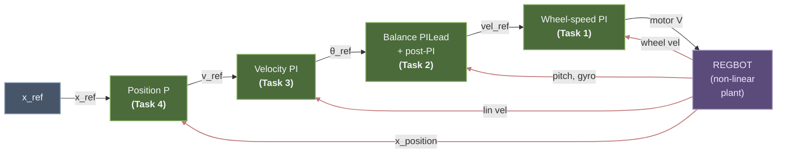

# REGBOT Balance Assignment

Cascaded four-loop control for the REGBOT self-balancing two-wheel robot. Each loop is designed with the frequency-domain phase-balance method, verified in Simulink on the non-linear Simscape Multibody model, and validated on the physical robot.

> [!example] Related Materials
> - [[Lesson 10 - Unstable Systems and REGBOT Balance]] — unstable-system theory + Nyquist primer (local copy)
> - [Lecture 10 Slides](obsidian://open?vault=Obsidian&file=Courses%2F34722%20Linear%20Control%20Design%201%2FSlides%2FLecture_10_Unstable_systems.pdf) *(opens in the DTU vault)*
> - [Fundamentals Guide](obsidian://open?vault=Obsidian&file=Courses%2F34722%20Linear%20Control%20Design%201%2FLecture%20Notes%2FFundamentals%20-%20Intuitive%20Control%20Theory) *(opens in the DTU vault)*
> - [Worked Example – REGBOT Position Controller](obsidian://open?vault=Obsidian&file=Courses%2F34722%20Linear%20Control%20Design%201%2FLecture%20Notes%2FWorked%20Example%20-%20REGBOT%20Position%20Controller) *(opens in the DTU vault)*
> - [Day 5 – Black Box Modeling](obsidian://open?vault=Obsidian&file=Courses%2F34722%20Linear%20Control%20Design%201%2FExercises%2FWork%2FDay%205%20-%20Black%20Box%20Modeling) — voltage-to-velocity identification *(DTU vault)*
> - [Day 8 & 9 – Position Controller Design](obsidian://open?vault=Obsidian&file=Courses%2F34722%20Linear%20Control%20Design%201%2FExercises%2FWork%2FDay%208%20%26%209%20-%20Position%20Controller%20Design) *(DTU vault)*

---

## Cascade architecture



Each outer loop is at least ${\sim}5\times$ slower than the one inside it, so the outer loop sees the inner loop as an approximately instantaneous unity gain. Red arrows are measurement feedbacks.

### Simulink implementation

![[regbot_simulink_model.png]]
*Top-level Simulink model (`regbot_1mg.slx`). Left to right: position-loop gain $K_{ppos}$, Velocity PI, $K_{pvel}$, `Tilt_Controller` subsystem (Task 2 — see Step 3 below), Wheel-velocity controller (Task 1) with $K_{pwv}$, integrator, and feed-forward branch, $\pm 9$ V limiter, and the `robot with balance` Simscape Multibody plant. The Disturbance block feeds a configurable 1 N / 0.1 s push into `desturb_force` for the Task 2 push-rejection test. Measured wheel velocity comes back through `wheel_vel_filter = 1/(twvlp\,s + 1)` to both the Task 1 error sum and the Task 3 (Velocity PI) outer error sum; pitch, gyro, and `x_position` tap directly from the robot block.*

---

## MATLAB design workflow

Four scripts in `simulink/`, run in order. Each one:

1. Loads the parameter + committed-gains workspace via `regbot_mg`.
2. Linearises the Simulink model at the right break point — previous loops closed, this one open. (Task 1 is the exception: it uses the Day 5 on-floor plant directly from the MAT file, no Simulink linearisation.)
3. Runs the phase-balance derivation, prints every intermediate value, saves plots into `docs/images/`.
4. Prints a copy-paste gains block. **Paste that back into `regbot_mg.m` before running the next script** — the next script linearises with the freshly designed gains active.

| # | Script | Relies on | Produces |
|---|---|---|---|
| 1 | `design_task1_wheel` | `data/Day5_results_v2.mat` (variable `G_1p_avg`) | $K_{pwv}$, $\tau_{iwv}$; `regbot_task1_{bode,step}.png` |
| 2 | `design_task2_balance` | Task 1 gains active | $K_{ptilt}$, $\tau_{itilt}$, $\tau_{dtilt}$, $\tau_{ipost}$; `regbot_Gtilt_*`, `regbot_task2_*` |
| 3 | `design_task3_velocity` | Tasks 1 + 2 active | $K_{pvel}$, $\tau_{ivel}$; `regbot_task3_*` |
| 4 | `design_task4_position` | Tasks 1 + 2 + 3 active | $K_{ppos}$, $\tau_{dpos}$; `regbot_task4_*` |

Output folder is resolved by `simulink/lib/pick_image_dir.m` → always `docs/images/`.

---

## Inner plant — Day 5 on-floor identification

Voltage-to-wheel-velocity plant identified from a 1-pole `tfest` fit on Day 5 on-floor training-wheels data (variable `G_1p_avg` in `data/Day5_results_v2.mat`):

$$G_{vel}(s) \;=\; \frac{2.198}{s + 5.985}$$

DC gain $0.367\,\mathrm{(m/s)/V}$, single pole at $-5.985$ rad/s ($\tau = 167$ ms). This is the operating regime the outer loops will see during the assignment missions.

See the _Day 5 redesign_ note at the bottom for why on-floor identification was used in preference to a wheels-up one.

---

## Task 1 — Wheel-speed PI

> [!tldr]+ Task 1 summary
> **Purpose.** Innermost cascade loop — PI from velocity reference to motor voltage. Fast enough that outer loops see it as instantaneous.
> **Plant.** $G_{vel}(s) = 2.198/(s+5.985)$ (Day 5 on-floor 1-pole fit).
> **Specs.** $\omega_c = 30$ rad/s, $\gamma_M \geq 60°$, $N_i = 3$.
> **Result.** $K_p = 13.2037$, $\tau_i = 0.100$ s. Achieved $\omega_c = 30.00$ rad/s, $\gamma_M = 82.85°$, $GM = \infty$. No Lead needed.

`design_task1_wheel.m`

![[regbot_simulink_wheel_velocity_controller.png]]
*The Simulink `Wheel velocity controller (WV)` block — what `Kpwv` and `tiwv` plug into. Parallel-form PI: top branch `1/tiwv → 1/s` is the integral term ($K_p/\tau_i \cdot \int e\,dt$), middle branch is `Kpwv` ($K_p \cdot e$), bottom feed-forward branch `Kffwv` is unused (set to 0). Sum of the three is the velocity command into the $\pm 9$ V limiter and the motor.*

### Why PI on this plant

Plant is **Type-0** (no integrator), so a P-controller leaves $e_{ss} = 1/(1+K_p K_{DC}) \neq 0$ on a step *([Lecture 9, slide 12](obsidian://open?vault=Obsidian&file=Courses%2F34722%20Linear%20Control%20Design%201%2FSlides%2FLecture_09_PI_LEAD_design_specifications.pdf#page=12))*. The PI lifts the loop to Type-1 → $e_{ss} \to 0$. Cascade rule sets $\omega_c \geq 2\times$ Task 2's 15 rad/s *([Lecture 10, slides 11–13](obsidian://open?vault=Obsidian&file=Courses%2F34722%20Linear%20Control%20Design%201%2FSlides%2FLecture_10_Unstable_systems.pdf#page=11))*.

> *Plain English: a pure P-controller pushes harder when there's error, but never quite drives error to zero — there's always a tiny gap where "P's push" balances the load. The I-part keeps adding push as long as any error exists, eventually closing the gap. Without an integrator somewhere in the loop, the wheel never quite hits the commanded speed.*

### The plant

$$G_{vel}(s) = \frac{2.198}{s + 5.985}$$

DC gain $0.367$ (m/s)/V, time constant $\tau = 167$ ms, break frequency $\omega_b = 5.985$ rad/s. Single-pole shape: flat then $-20$ dB/dec, phase $0° \to -45°$ at the break $\to -90°$ asymptote *([Lecture 6, slides 6–8](obsidian://open?vault=Obsidian&file=Courses%2F34722%20Linear%20Control%20Design%201%2FSlides%2F6_Bode_plot%26Stability.pdf#page=6))*.

> *Plain English: DC gain says "1 V → 0.367 m/s eventually." Time constant says "it takes 167 ms to reach 63% of that." Break frequency says "above 5.985 rad/s the motor can't keep up with how fast you're commanding."*

![[regbot_task1_step1_plant_bode.png]]
*Bare-plant Bode. Three features above readable directly from the curves.*

### Specs

| Spec | Value | Source |
|---|---|---|
| $\omega_c$ | $30$ rad/s | Cascade rule: $\geq 2\times$ Task 2, $\geq 5\times \omega_b$ *([Lec 10, sl. 11–13](obsidian://open?vault=Obsidian&file=Courses%2F34722%20Linear%20Control%20Design%201%2FSlides%2FLecture_10_Unstable_systems.pdf#page=11))* |
| $\gamma_M$ | $\geq 60°$ | Course default → $\zeta \approx 0.6$, ~10% overshoot *([Lec 9 sl. 7](obsidian://open?vault=Obsidian&file=Courses%2F34722%20Linear%20Control%20Design%201%2FSlides%2FLecture_09_PI_LEAD_design_specifications.pdf#page=7); [Lec 6 sl. 10](obsidian://open?vault=Obsidian&file=Courses%2F34722%20Linear%20Control%20Design%201%2FSlides%2F6_Bode_plot%26Stability.pdf#page=10))* |
| $N_i$ | $3$ | PI zero at $\omega_c/N_i$; course default *([Lec 8, sl. 8–9, 14](obsidian://open?vault=Obsidian&file=Courses%2F34722%20Linear%20Control%20Design%201%2FSlides%2FLecture_08_PI_LEAD_design.pdf#page=8))* |

### Step 1 — PI zero placement

$$\tau_i = \frac{N_i}{\omega_c} = \frac{3}{30} = 0.100 \text{ s}, \qquad C_{PI,\text{shape}}(s) = \frac{\tau_i s + 1}{\tau_i s}$$

Zero at $1/\tau_i = 10$ rad/s. PI phase at $\omega_c$: $\phi_{PI} = \arctan(N_i) - 90° = -18.43°$ *([Lecture 8, slide 8](obsidian://open?vault=Obsidian&file=Courses%2F34722%20Linear%20Control%20Design%201%2FSlides%2FLecture_08_PI_LEAD_design.pdf#page=8))*.

![[regbot_task1_step3_pi_overlay.png]]
*Plant (blue), PI shape with $K_p = 1$ (orange), combined (yellow). Yellow is what we'll scale with $K_p$ next.*

### Step 2 — Phase balance

Phase-balance equation *([Lecture 8, slide 10](obsidian://open?vault=Obsidian&file=Courses%2F34722%20Linear%20Control%20Design%201%2FSlides%2FLecture_08_PI_LEAD_design.pdf#page=10))*, with $\gamma_M = 180° + \angle L(j\omega_c)$ *([Lecture 7, slide 12](obsidian://open?vault=Obsidian&file=Courses%2F34722%20Linear%20Control%20Design%201%2FSlides%2FLecture_07_Nyquist%20plot%20and%20stability.pdf#page=12))*:

$$\phi_{Lead} = (\gamma_M - 180°) - \angle G_{vel}(j\omega_c) - \phi_{PI}$$

| Term | Value |
|---|---|
| $\angle G_{vel}(j30) = -\arctan(30/5.985)$ | $-78.71°$ |
| $\phi_{PI}$ | $-18.43°$ |
| Natural $\gamma_M$ | $+82.86°$ ✓ |
| Required $\phi_{Lead}$ | $-22.86°$ → **No Lead** |

> *Plain English: at $\omega_c = 30$, the loop's phase is $-97°$. The "danger line" (where the loop would oscillate forever) is $-180°$. We're $83°$ from danger. Spec is $60°$. We have $23°$ of safety to spare → no Lead block needed.*

![[regbot_task1_step4_phase_balance.png]]
*Phase at $\omega_c$ (red) sits $\approx 23°$ above the $-120°$ floor (green) → spec already met.*

### Step 3 — Solve $K_p$

Magnitude condition $|L(j\omega_c)| = 1$ *([Lecture 8, slide 10](obsidian://open?vault=Obsidian&file=Courses%2F34722%20Linear%20Control%20Design%201%2FSlides%2FLecture_08_PI_LEAD_design.pdf#page=10))*. $K_p$ is flat gain — lifts the magnitude curve uniformly:

$$K_p = \frac{1}{|C_{PI,\text{shape}}(j\omega_c) \cdot G_{vel}(j\omega_c)|} = \frac{1}{0.0758} = 13.2037$$

> *Plain English: at $\omega_c$, the unscaled loop is $22$ dB too quiet. $K_p$ multiplies it by $13.2$ ($= +22$ dB) to bring it exactly to $0$ dB. That's all $K_p$ does — uniform amplification of the whole curve.*

$$\boxed{\;C_{wv}(s) = 13.2037 \cdot \frac{0.1\,s + 1}{0.1\,s}\;}$$

### Verification

`margin(L_wv)`: $\omega_c = 30.00$ rad/s, $\gamma_M = 82.85°$, $GM = \infty$ — matches the hand calculation.

![[regbot_task1_bode.png]]
*Open-loop $L_{wv} = C_{wv}\,G_{vel}$. $Gm = \infty$, $Pm = 82.8°$ at $30$ rad/s.*

![[regbot_task1_step.png]]
*Closed-loop step. Rise ${\sim}75$ ms, ${\sim}4\%$ overshoot, settles by $0.3$ s, zero $e_{ss}$.*

### Paste into `regbot_mg.m`

```matlab
Kpwv  = 13.2037;
tiwv  = 0.1000;
Kffwv = 0;
```

With these gains active, `design_task2_balance` can linearise `vel_ref → tilt` to produce $G_{tilt}$ — the plant for Task 2.

---

## Task 2 — Balance (Lecture 10 Method 2)

> [!tldr]+ Task 2 summary
> **Purpose.** Stabilise the inverted pendulum. Plant `Gtilt` (vel_ref → tilt) is **unstable** — has an RHP pole at $+9.13$ rad/s. Plain PI-Lead can't fix it; we use Lecture 10 **Method 2**: sign-flip → post-integrator → outer PI-Lead.
> **Result.** $K_p = 1.1999$, $\tau_i = 0.200$, $\tau_d = 0.0442$, $\tau_{i,\text{post}} = 0.1245$. Achieved $\omega_c = 15.00$ rad/s, $\gamma_M = 60.00°$, 0 RHP closed-loop poles.
> **Firmware sign.** `[cbal] kp` is entered as **negative** — the firmware Balance block doesn't absorb the Method 2 sign flip; positive `kp` produces a runaway.

`design_task2_balance.m`

### Why this is harder than Task 1

The plant is **unstable** — has a pole in the RHP, so any tiny tilt grows like $e^{9.13\,t}$ until the robot falls *([Lec 10, sl. 4](obsidian://open?vault=Obsidian&file=Courses%2F34722%20Linear%20Control%20Design%201%2FSlides%2FLecture_10_Unstable_systems.pdf#page=4))*.

> *Plain English: this is "balance a broomstick on your palm" — gravity actively pushes the system away from upright. The controller fights gravity, not just nudges the wheel.*

A regular PI-Lead can't stabilise this. The **Nyquist criterion** says `Z = N + P` *([Lec 7, sl. 6](obsidian://open?vault=Obsidian&file=Courses%2F34722%20Linear%20Control%20Design%201%2FSlides%2FLecture_07_Nyquist%20plot%20and%20stability.pdf#page=6))*: closed-loop RHP poles = open-loop RHP poles + CW encirclements of (−1). We have $P = 1$, want $Z = 0$, so need **one CCW encirclement** of (−1). Positive Kp can never produce that — we need a **sign flip** *([Lec 10, sl. 5](obsidian://open?vault=Obsidian&file=Courses%2F34722%20Linear%20Control%20Design%201%2FSlides%2FLecture_10_Unstable_systems.pdf#page=5))*.

That's **Method 2** *([Lec 10, sl. 11](obsidian://open?vault=Obsidian&file=Courses%2F34722%20Linear%20Control%20Design%201%2FSlides%2FLecture_10_Unstable_systems.pdf#page=11))*: bundle a `−1` and a PI-zero-at-the-magnitude-peak into the loop, then design a normal PI-Lead on top of the result.

> *Plain English: we don't make the plant stable directly. We reshape its Bode curve so a normal controller can finish the job.*

### The plant

Linearise `vel_ref → tilt` with Task 1 closed → 7th-order $G_{tilt}$:

![[regbot_Gtilt_pzmap_zoom.png]]
*Pole-zero map. Orange ring: RHP pole at $+9.13$ rad/s — the falling mode.*

| Feature | Value | Meaning |
|---|---|---|
| RHP pole | $+9.13$ rad/s | Falling mode; $P = 1$ for Nyquist |
| LHP complex pair | $-8 \pm 3j$ | Resonance — magnitude peak near $\omega = 8$ rad/s |
| RHP zero | $+8$ rad/s | Non-minimum-phase: wheels move *wrong way first* |
| DC gain | $+4.83 \times 10^{-4}$ | Sign forces sign($K_{PS}$) = −1 |

### Specs

| Spec | Value | Source |
|---|---|---|
| $\omega_c$ | $15$ rad/s | Above resonance (~8); $\geq 15\times$ Task 3's $1$ |
| $\gamma_M$ | $\geq 60°$ | Course default |
| $N_i$ | $3$ | Same as Task 1 |

Method 2 = four steps: **sign-flip → post-integrator → outer PI-Lead → verify**.

### Step 1 — Sign of K_PS from Nyquist

DC gain > 0 + $P = 1$ → need $N = -1$ (one CCW). Positive Kp can't do this; **negative Kp** rotates the curve 180° → CCW *([Lec 10, sl. 5](obsidian://open?vault=Obsidian&file=Courses%2F34722%20Linear%20Control%20Design%201%2FSlides%2FLecture_10_Unstable_systems.pdf#page=5))*. Sign-flip is bundled into the post-integrator in Step 2.

> *Plain English: the math says we have to flip a sign somewhere. We hide it in the post-integrator block so the rest of the design stays positive.*

### Step 2 — Post-integrator at the magnitude peak

Find $\omega_\text{peak}$ where $|G_{tilt}|$ peaks: **$\omega_\text{peak} = 8.03$ rad/s**, peak value $0.7133$. Place the post-integrator zero at that frequency:

$$\tau_{i,\text{post}} = \frac{1}{\omega_\text{peak}} = 0.1245 \text{ s}, \quad C_{PI,\text{post}}(s) = \frac{\tau_{i,\text{post}}\,s + 1}{\tau_{i,\text{post}}\,s}, \quad G_{tilt,\text{post}} = -\,C_{PI,\text{post}} \cdot G_{tilt}$$

*([Lec 10, sl. 11](obsidian://open?vault=Obsidian&file=Courses%2F34722%20Linear%20Control%20Design%201%2FSlides%2FLecture_10_Unstable_systems.pdf#page=11))*

> *Plain English: a magnitude peak is bad — loop gain spikes there. The post-integrator's zero (+20 dB/dec) cancels the rise; the integrator's −20 dB/dec then takes over above the peak. Result: a smooth, monotonically decreasing curve we can design on top of.*

![[regbot_task2_bode_post.png]]
*Blue: $G_{tilt}$ (hump near 8 rad/s). Orange: $G_{tilt,\text{post}}$ (hump flattened, monotonic).*

![[regbot_task2_nyquist_post.png]]
*Nyquist of $G_{tilt,\text{post}}$ — one CCW encirclement of $(-1, 0)$. With $P = 1$, $Z = N + P = 0$ → stabilisable.*

### Step 3 — Outer PI-Lead on $G_{tilt,\text{post}}$

Standard recipe (same as Task 1).

**PI zero:** $\tau_i = N_i/\omega_c = 3/15 = 0.200$ s.

**Phase balance at $\omega_c = 15$:**

| Term | Value |
|---|---|
| $\angle G_{tilt,\text{post}}(j15)$ | $-135.09°$ |
| $\phi_{PI}$ | $-18.43°$ |
| Required $\phi_{Lead}$ | **+33.52°** → Lead needed |

> *Plain English: the post-integrator's phase is steep at $\omega_c$ — eats our cushion. We add a Lead to put some phase back.*

![[regbot_task2_phase_balance.png]]
*Combined $C_{PI} \cdot C_\text{Lead} \cdot G_{tilt,\text{post}}$ Bode with $\omega_c = 15$ (red) and the $-180° + \gamma_M = -120°$ floor (green). With the Lead applied, the phase at $\omega_c$ sits **on** the green line → $\gamma_M = 60°$ exactly.*

**Gyro shortcut.** A standard Lead is $(\tau_d s + 1)/(\alpha \tau_d s + 1)$ — needs an $\alpha$-pole to keep noise bounded *([Lec 8, sl. 25](obsidian://open?vault=Obsidian&file=Courses%2F34722%20Linear%20Control%20Design%201%2FSlides%2FLecture_08_PI_LEAD_design.pdf#page=25))*. But the REGBOT gyro **measures $\dot\theta$ directly**, so we implement `τ_d · gyro + θ` — an *ideal* Lead $(\tau_d s + 1)$ with no filter pole *([Lec 10, sl. 9](obsidian://open?vault=Obsidian&file=Courses%2F34722%20Linear%20Control%20Design%201%2FSlides%2FLecture_10_Unstable_systems.pdf#page=9))*.

> *Plain English: the gyro already gives us the derivative for free. No need to differentiate numerically, no need for a noise-filter pole.*

$$\tau_d = \frac{\tan 33.52°}{15} = 0.0442 \text{ s}$$

**Gain:** $|C_{PI} \cdot C_\text{Lead} \cdot G_{tilt,\text{post}}|(j15) = 0.8334$ → $K_p = 1.1999$.

$$\boxed{\;C_\text{tilt}(s) = -1.1999 \cdot \frac{0.1245\,s + 1}{0.1245\,s} \cdot \frac{0.2\,s + 1}{0.2\,s} \cdot (0.0442\,s + 1)\;}$$

![[regbot_simulink_tilt_controller.png]]
*Simulink `Tilt_Controller` subsystem (full view). Gyro × `tdtilt` summed with pitch (ideal Lead), then sign-flip, post-integrator, outer PI, gain `Kptilt` → `vel_ref`.*

![[regbot_simulink_tilt_controller_inner.png]]
*Inner block diagram (cleaner view). Signal flow left → right: error sum, sign-flip $-1$, then **two transfer-function blocks** in series, then $K_{ptilt}$.*

**The two TFs in the middle — what each one does:**

| Block | Formula | Role |
|---|---|---|
| Left box | $\dfrac{\texttt{tipost}\,s + 1}{\texttt{tipost}\,s}$ | **Post-integrator** (Method 2, Step 2). Zero at $1/\texttt{tipost} = \omega_\text{peak} = 8.03$ rad/s — placed exactly on the plant's magnitude peak so the combined `Gtilt,post` curve becomes monotonic. Combined with the −1 sign-flip in front, this is what makes the plant stabilisable. |
| Right box | $\dfrac{\texttt{titilt}\,s + 1}{\texttt{titilt}\,s}$ | **Outer PI** (Method 2, Step 3). Zero at $1/\texttt{titilt} = \omega_c/N_i = 5$ rad/s. Standard PI on the now-stabilisable plant — drives the outer-loop steady-state error to zero. |

> *Plain English: the left block reshapes the unstable plant into something we can design on top of. The right block is the "normal" PI we'd have used if the plant had been stable to begin with.*

### Step 4 — Verification

`margin(L_tilt)`: $\omega_c = 15.00$, $\gamma_M = 60.00°$, $GM = -5.58$ dB, 0 closed-loop RHP poles ✓. Linear IC ($\theta_0 = 10°$) settles in 1.34 s with $\sim 6.6°$ undershoot (RHP-zero signature: wheels roll backward briefly).

> [!note] Negative gain margin is **expected** for unstable plants
> For a plant with $P = 1$ RHP pole, `margin` reports the *lower* bound on $|K|$ — the minimum factor by which the gain could be **reduced** before stability is lost. Negative GM in dB on an unstable plant = correct. Positive GM would mean reducing the gain couldn't destabilise it (impossible if the plant was unstable to begin with).

![[regbot_task2_loop_bode.png]]
*Open-loop $L_{tilt}$. Crossover at 15 rad/s, $\gamma_M = 60°$.*

![[regbot_task2_ic_response.png]]
*Linear $\theta_0 = 10°$ recovery. Peak undershoot $\sim 6.6°$, settles in $\sim 1.34$ s.*

### Paste into `regbot_mg.m`

```matlab
Kptilt = 1.1999;
titilt = 0.2000;
tdtilt = 0.0442;
tipost = 0.1245;
```

> [!warning] Firmware sign on `[cbal] kp` is **negative**
> Method 2 bundles a $-1$ in $G_{tilt,\text{post}}$. The REGBOT firmware Balance block does *not* absorb it internally — entering positive `kp` produces a positive-feedback runaway. In `config/regbot_group47.ini`: `kp = -1.1999`.

![[regbot_task2_sim_recovery_10deg_v3.png]]
*Simulink non-linear sim: $10°$ recovery in $\sim 0.3$ s, fully settled by 2 s. Peak motor voltage $2.8$ V (no saturation).*

---

## Task 3 — Velocity PI

> [!tldr]+ Task 3 summary
> **Purpose.** Wrap a velocity loop around the stabilised balance loop. Commanding $v_\text{ref}$ produces a tilt command; the balance loop drives the body to that tilt; the body accelerates.
> **Plant.** Linearise $\theta_\text{ref} \to v$ with Tasks 1+2 closed → 9th-order, **0 RHP poles** (balance loop did its job), **RHP zero at $+8.51$ rad/s** (physics — robot must roll backward to tilt forward).
> **Result.** $K_p = 0.1581$, $\tau_i = 3.000$ s. Achieved $\omega_c = 1.00$ rad/s, $\gamma_M = 68.98°$, $GM = 5.84$ dB.

`design_task3_velocity.m`

### Why this loop is straightforward but bandwidth-capped

Task 2 stabilised the pendulum, so $G_{vel,\text{outer}}$ has 0 RHP poles — back to a normal stable plant, no Method 2 acrobatics needed. Standard PI design works.

But the plant has an **RHP zero at $+8.51$ rad/s** — non-minimum-phase. Magnitude rises like a normal zero, but the phase goes the *wrong way* (down 90° instead of up) *([Lec 6, sl. 28](obsidian://open?vault=Obsidian&file=Courses%2F34722%20Linear%20Control%20Design%201%2FSlides%2F6_Bode_plot%26Stability.pdf#page=28))*.

> *Plain English: to make the robot accelerate forward, the wheels have to roll backward first to put the centre of mass over the pivot — like leaning forward to start running. That backward roll is the RHP zero, and it's a hard physics limit on how fast you can ask this loop to react.*

### The plant

![[regbot_task3_plant_pz.png]]
*Pole-zero map: 0 RHP poles, RHP zero at $+8.67$ rad/s, free integrator at the origin.*

| Feature | Meaning |
|---|---|
| 0 RHP poles | Task 2 stabilisation worked |
| RHP zero at $+8.51$ rad/s | Physics — caps bandwidth |
| Free integrator at origin | From Task 2's post-integrator → plant is Type-1 |

### The bandwidth ceiling

Standard textbook rule of thumb: with an RHP zero at frequency $z = 8.51$ rad/s, keep $\omega_c \leq z/5 \approx 1.70$ rad/s. Pushing closer trades phase margin for "wrong-way-first" overshoot in the step response. (Not in the lecture slides — this is a general control-theory rule.)

We pick **$\omega_c = 1$ rad/s** for safety margin. Also satisfies the cascade rule (15× slower than Task 2).

> *Plain English: the RHP zero says "you can't make this loop react faster than ~1.7 rad/s without the step response getting weird." We stay well below that.*

### Specs

| Spec | Value | Source |
|---|---|---|
| $\omega_c$ | $1$ rad/s | RHP-zero limit + cascade rule |
| $\gamma_M$ | $\geq 60°$ | Course default |
| $N_i$ | $3$ | Same as Tasks 1, 2 |

### Step 1 — PI zero placement

$\tau_i = N_i/\omega_c = 3/1 = 3.000$ s. Zero at $1/\tau_i = 0.333$ rad/s — same recipe as Task 1.

### Step 2 — Phase balance

At $\omega_c = 1$: $\angle G_{vel,\text{outer}}(j1) = -92.58°$, $\phi_{PI} = -18.43°$ → natural $\gamma_M = +69°$ ✓. **No Lead.**

![[regbot_task3_phase_balance.png]]
*Combined $C_{PI} \cdot G_{vel,\text{outer}}$ Bode with $\omega_c = 1$ (red) and the $-120°$ floor (green). Phase at $\omega_c$ sits $\sim 9°$ above the green line → spec already met without a Lead. (MATLAB plots the phase unwrapped, so the visible curve hangs near $+240°$ — same angle as $-120°$ after subtracting 360°.)*

> [!note] MATLAB's continuous-phase quirk
> The script prints $+267.42°$ instead of $-92.58°$ — same angle, just unwrapped. Subtract 360° to read it physically. Same thing happens on the Bode plot in Step 4: phase near $\omega_c$ reads $\approx +240°$ which is really $-120°$.

### Step 3 — Solve $K_p$

$|C_{PI} \cdot G_{vel,\text{outer}}|(j1) = 6.3254$ → $K_p = 1/6.3254 = 0.1581$.

> *Plain English: opposite of Task 1. The plant is already loud at $\omega_c = 1$ thanks to its free integrator, so we **attenuate** ($K_p < 1$) instead of amplifying.*

$$\boxed{\;C_\text{vel}(s) = 0.1581 \cdot \frac{3\,s + 1}{3\,s}\;}$$

### Verification

`margin(L_vel)`: $\omega_c = 1.00$, $\gamma_M = 68.98°$, $GM = 5.84$ dB, 0 RHP closed-loop poles ✓.

![[regbot_task3_loop_bode.png]]
*Open-loop Bode. Crossover at 1 rad/s, ~69° PM.*

![[regbot_task3_step.png]]
*Closed-loop step. Rise ~1 s. **No visible inverse response** — $\omega_c = 1$ is well below the RHP zero at 8.51, so the "wrong-way-first" mode isn't excited.*

### Paste into `regbot_mg.m`

```matlab
Kpvel = 0.1581;
tivel = 3.0000;
```

---

## Task 4 — Position P (+ tiny Lead, dropped for Simulink)

> [!tldr]+ Task 4 summary
> **Purpose.** Outermost loop — drive the robot to a target $x_\text{ref}$ (the `topos` mission command). Output $v_\text{ref}$ feeds Task 3.
> **Plant.** With Tasks 1+2+3 closed, $G_{pos,\text{outer}}$ is 11th-order, 0 RHP poles, RHP zero at $+8.51$ rad/s (still physics), **plus a free integrator at the origin** (position is $\int v$).
> **Why P, not PI.** Free integrator already makes the plant Type-1 → P alone gives $e_{ss} = 0$ on a step.
> **Result.** $K_p = 0.5411$, $\tau_d = 0$ (Lead dropped — see warning). Achieved $\omega_c = 0.60$ rad/s, $\gamma_M \approx 57°$ in firmware, $GM = 25.17$ dB.

`design_task4_position.m`

### Why pure P is enough

Plant has a free integrator (position = $\int$ velocity), so it's already Type-1. *([Lec 9, sl. 34](obsidian://open?vault=Obsidian&file=Courses%2F34722%20Linear%20Control%20Design%201%2FSlides%2FLecture_09_PI_LEAD_design_specifications.pdf#page=34): for $n \geq 1$, $e_{ss} = 0$ on a step with just P.)* No PI needed.

> *Plain English: the wheels integrate velocity into position automatically — the "memory" we needed an I-part for in Task 1 is built into the physics here.*

### The plant

![[regbot_task4_plant_pz.png]]
*Pole-zero map: 0 RHP poles, RHP zero at $+8.51$ (inherited from Task 3), free integrator at $s = 0$.*

### Why $\omega_c = 0.6$ — iterated, not derived

Tasks 1–3 picked $\omega_c$ from cascade and bandwidth rules. Task 4 picks it by **iterating against the mission spec**: reach 2 m, peak velocity $\geq 0.7$ m/s, in $\leq 10$ s.

| $\omega_c$ tried | $\gamma_M$ | Peak v | Settle | Verdict |
|---|---|---|---|---|
| $0.2$ | $87°$ | $0.33$ m/s | $20$ s | Too slow |
| $0.5$ | $66°$ | $0.68$ m/s | $12$ s | Just short |
| **$0.6$** | **${\approx}60°$** | **${\approx}0.82$ m/s** | **${\approx}10$ s** | **Chosen** |

> *Plain English: outer loops are where mission specs (peak speed, time-to-target) start dictating the design instead of margin rules. The inner loops set up the bandwidth budget; the outer loop spends it.*

### Specs

| Spec | Value | Source |
|---|---|---|
| $\omega_c$ | $0.6$ rad/s | Iterated against mission |
| $\gamma_M$ | $\geq 60°$ | Course default |

(No $N_i$ — no PI.)

### Step 1 — Phase balance (Lead?)

No PI, so the equation simplifies. At $\omega_c = 0.6$: $\angle G_{pos,\text{outer}}(j0.6) = -122.85°$ → required Lead = **+2.85°**. Tiny.

Ideal Lead: $\tau_d = \tan(2.85°)/0.6 = 0.0831$ s.

![[regbot_task4_phase_balance.png]]
*Combined $C_\text{Lead} \cdot G_{pos,\text{outer}}$ Bode with $\omega_c = 0.6$ (red) and the $-120°$ floor (green). With the tiny Lead applied, phase at $\omega_c$ sits exactly on the green line → $\gamma_M = 60°$. Drop the Lead in firmware (next callout) and you lose $2.85°$ — visually, the phase curve dips fractionally below the green line.*

### Step 2 — Solve $K_p$

$|C_\text{Lead} \cdot G_{pos,\text{outer}}|(j0.6) = 1.8481$ → $K_p = 1/1.8481 = 0.5411$.

$$\boxed{\;C_\text{pos}(s) = 0.5411 \cdot (0.0831\,s + 1)\;} \text{ (design-time)}$$

### The Lead drop — why firmware runs pure P

> [!warning] The ideal Lead $(\tau_d s + 1)$ is improper — Simulink rejects it
> A bare $(\tau_d s + 1)$ has numerator degree > denominator degree (improper) — physically a pure differentiator, can't run as an ODE block. Standard fix is a **proper Lead** $(\tau_d s + 1)/(\alpha\tau_d s + 1)$ with small $\alpha$ *([Lec 8, sl. 25](obsidian://open?vault=Obsidian&file=Courses%2F34722%20Linear%20Control%20Design%201%2FSlides%2FLecture_08_PI_LEAD_design.pdf#page=25))* — but that adds a fast filter pole costing some phase back. Since the required Lead is only $2.85°$ — basically noise — we just **drop it**: $\tau_d = 0$, accepting a $\sim 2.85°$ PM cost. $25$ dB gain margin dominates robustness anyway.

> *Plain English: in Task 2 the Lead was big (+33°) and the gyro made it implementable for free. Here the Lead is tiny and would cost a filter pole — not worth bothering. Just skip.*

### Verification

Design-time (with Lead): $\omega_c = 0.60$, $\gamma_M = 60.00°$, $GM = 25.17$ dB, 0 RHP closed-loop poles. Linear 2 m step: peak $v = 0.753$ m/s ✓, settles in $\sim 11$ s.

![[regbot_task4_loop_bode.png]]
*Open-loop Bode. $\omega_c = 0.6$ rad/s, $\gamma_M = 60°$.*

![[regbot_task4_step.png]]
*Linear closed-loop 2 m step.*

### Paste into `regbot_mg.m`

```matlab
Kppos = 0.5411;
tdpos = 0;          % Lead dropped — see warning
```

![[regbot_task4_sim_step_v3.png]]
*Simulink non-linear sim, full cascade, 2 m step. Peak position $2.15$ m (7.5% overshoot), settles at $2.00$ m. Peak $v \approx 0.80$ m/s, peak motor voltage $\approx 3$ V.*

---

## Final committed gains

`regbot_mg.m` (workspace) and `config/regbot_group47.ini` (firmware):

| Loop | Type | $\omega_c$ | $\gamma_M$ | Parameters |
|---|---|---|---|---|
| 1 — Wheel speed | PI | $30.00$ rad/s | $82.85°$ | $K_p = 13.2037$, $\tau_i = 0.100$ s |
| 2 — Balance | PILead + post-PI | $15.00$ rad/s | $60.00°$ | $K_p = 1.1999$, $\tau_i = 0.200$ s, $\tau_d = 0.0442$ s, $\tau_{i,\text{post}} = 0.1245$ s |
| 3 — Velocity | PI | $1.00$ rad/s | $68.98°$ | $K_p = 0.1581$, $\tau_i = 3.000$ s |
| 4 — Position | P (Lead dropped) | $0.60$ rad/s | ${\approx}57°$ | $K_p = 0.5411$, $\tau_d = 0$ |

---

## Hardware validation (2026-04-22)

| Test | Spec | Result |
|---|---|---|
| **0** — wheel speed at $0.3$ m/s, balance off | reach $0.27$ m/s $\approx 0.3$ s | **$0.012$ s** rise, peak V $2.60$ V, L/R agreement $0.76\%$ ✓ |
| **3a** — balance at rest, $10$ s | drift $\leq 0.5$ m | **$0.343$ m** (v2 run, reportable). v3 run shows $61\%$ tighter tilt std but marginally larger drift ($0.505$ m) from residual ${\approx}1°$ tilt-offset bias |
| **3b** — square at $0.8$ m/s | 4 sides + 3 turns without falling | heading $359.8°$, peak tilt $+25.5°$, tilt std $5.03°$, peak V **$7.31$ V** ($91\%$ of $\pm 8$ V budget) ✓ |
| **4** — $2$ m `topos` step | peak $v \geq 0.7$ m/s, reach $2$ m in $10$ s | final $1.964$ m (**$3.6$ cm short**), no overshoot, no late limit cycle, peak $v = 0.79$ m/s, peak tilt $+17.3°$, peak V $4.95$ V ✓ |

Logs in `logs/test*_v3_onfloor_*.txt`; plots in `docs/images/test*_v3_onfloor_*.png`.

---

## Notes

### Day 5 on-floor redesign (why these are v3 numbers)

The initial campaign used the Day 4 **wheels-up** identification $G_{vel} = 13.34/(s+35.71)$ ($\tau = 28$ ms). That design met every assignment spec on the bench, but hardware Test 0 measured a rise time of $0.329$ s — the designed $30$ rad/s inner bandwidth was effectively only ${\approx}9$ rad/s in practice. Root cause: the wheels-up pole is ${\approx}6\times$ faster than the true on-floor pole. Re-identifying against `data/Day5_results_v2.mat` and keeping the same targets lifts $K_{pwv}$ from $3.31$ to $13.20$ ($4\times$); Tasks 2–4 retune accordingly because re-linearising with the Day 5 inner loop in place shifts every outer plant. Hardware Test 0 rise dropped to $0.012$ s ($27\times$ faster), Test 4 final-position error improved $10.7 \to 3.6$ cm, and the Test 4 late limit cycle visible in the earlier campaign disappeared. Trade-off: Test 3b peak motor voltage rose $4.67 \to 7.31$ V ($58\% \to 91\%$ of $\pm 8$ V budget) — the inner PI now reacts $4\times$ harder to sharp corner-entry `vel_ref` steps.

Full phase tracker and handoff: [[REDESIGN_ROADMAP]], [[HANDOFF]].

### Firmware sign flip on the balance block

Method 2 bundles a $-1$ with the post-integrator: $G_{tilt,\text{post}} = -C_{PI,\text{post}}\,G_{tilt}$. The REGBOT firmware Balance controller does **not** absorb that sign internally — entering `kp = +|K_{ptilt}|` in `[cbal]` produced a positive-feedback runaway in the first campaign. The firmware-side `kp` must be entered as $-\,|K_{ptilt}|$.

### Plot output location

All design scripts write into `docs/images/` via `simulink/lib/pick_image_dir.m`. Re-running any script overwrites the plots in place; commit the new PNGs alongside the updated gains block in `regbot_mg.m`.
