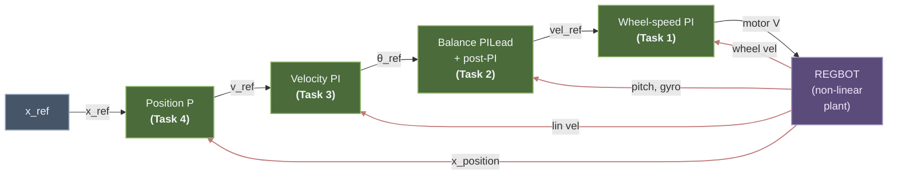

# REGBOT Balance Assignment

Cascaded four-loop control for the REGBOT self-balancing two-wheel robot. Each loop is designed with the frequency-domain phase-balance method, verified in Simulink on the non-linear Simscape Multibody model, and validated on the physical robot.

> [!example] Related Materials
> - [[Lesson 10 - Unstable Systems and REGBOT Balance]] — unstable-system theory + Nyquist primer (local copy)
> - [Lecture 10 Slides](obsidian://open?vault=Obsidian&file=Courses%2F34722%20Linear%20Control%20Design%201%2FSlides%2FLecture_10_Unstable_systems.pdf) *(opens in the DTU vault)*
> - [Fundamentals Guide](obsidian://open?vault=Obsidian&file=Courses%2F34722%20Linear%20Control%20Design%201%2FLecture%20Notes%2FFundamentals%20-%20Intuitive%20Control%20Theory) *(opens in the DTU vault)*
> - [Worked Example – REGBOT Position Controller](obsidian://open?vault=Obsidian&file=Courses%2F34722%20Linear%20Control%20Design%201%2FLecture%20Notes%2FWorked%20Example%20-%20REGBOT%20Position%20Controller) *(opens in the DTU vault)*
> - [Day 5 – Black Box Modeling](obsidian://open?vault=Obsidian&file=Courses%2F34722%20Linear%20Control%20Design%201%2FExercises%2FWork%2FDay%205%20-%20Black%20Box%20Modeling) — voltage-to-velocity identification *(DTU vault)*
> - [Day 8 & 9 – Position Controller Design](obsidian://open?vault=Obsidian&file=Courses%2F34722%20Linear%20Control%20Design%201%2FExercises%2FWork%2FDay%208%20%26%209%20-%20Position%20Controller%20Design) *(DTU vault)*

---

## Cascade architecture



Each outer loop is at least ${\sim}5\times$ slower than the one inside it, so the outer loop sees the inner loop as an approximately instantaneous unity gain. Red arrows are measurement feedbacks.

### Simulink implementation

![[regbot_simulink_model.png]]
*Top-level Simulink model (`regbot_1mg.slx`). Left to right: position-loop gain $K_{ppos}$, Velocity PI, $K_{pvel}$, `Tilt_Controller` subsystem (Task 2 — see Step 3 below), Wheel-velocity controller (Task 1) with $K_{pwv}$, integrator, and feed-forward branch, $\pm 9$ V limiter, and the `robot with balance` Simscape Multibody plant. The Disturbance block feeds a configurable 1 N / 0.1 s push into `desturb_force` for the Task 2 push-rejection test. Measured wheel velocity comes back through `wheel_vel_filter = 1/(twvlp\,s + 1)` to both the Task 1 error sum and the Task 3 (Velocity PI) outer error sum; pitch, gyro, and `x_position` tap directly from the robot block.*

---

## MATLAB design workflow

Four scripts in `simulink/`, run in order. Each one:

1. Loads the parameter + committed-gains workspace via `regbot_mg`.
2. Linearises the Simulink model at the right break point — previous loops closed, this one open. (Task 1 is the exception: it uses the Day 5 on-floor plant directly from the MAT file, no Simulink linearisation.)
3. Runs the phase-balance derivation, prints every intermediate value, saves plots into `docs/images/`.
4. Prints a copy-paste gains block. **Paste that back into `regbot_mg.m` before running the next script** — the next script linearises with the freshly designed gains active.

| # | Script | Relies on | Produces |
|---|---|---|---|
| 1 | `design_task1_wheel` | `data/Day5_results_v2.mat` (variable `G_1p_avg`) | $K_{pwv}$, $\tau_{iwv}$; `regbot_task1_{bode,step}.png` |
| 2 | `design_task2_balance` | Task 1 gains active | $K_{ptilt}$, $\tau_{itilt}$, $\tau_{dtilt}$, $\tau_{ipost}$; `regbot_Gtilt_*`, `regbot_task2_*` |
| 3 | `design_task3_velocity` | Tasks 1 + 2 active | $K_{pvel}$, $\tau_{ivel}$; `regbot_task3_*` |
| 4 | `design_task4_position` | Tasks 1 + 2 + 3 active | $K_{ppos}$, $\tau_{dpos}$; `regbot_task4_*` |

Output folder is resolved by `simulink/lib/pick_image_dir.m` → always `docs/images/`.

---

## Inner plant — Day 5 on-floor identification

Voltage-to-wheel-velocity plant identified from a 1-pole `tfest` fit on Day 5 on-floor training-wheels data (variable `G_1p_avg` in `data/Day5_results_v2.mat`):

$$G_{vel}(s) \;=\; \frac{2.198}{s + 5.985}$$

DC gain $0.367\,\mathrm{(m/s)/V}$, single pole at $-5.985$ rad/s ($\tau = 167$ ms). This is the operating regime the outer loops will see during the assignment missions.

See the _Day 5 redesign_ note at the bottom for why on-floor identification was used in preference to a wheels-up one.

---

## Task 1 — Wheel-speed PI

> [!tldr]+ Task 1 summary
> **Script:** `design_task1_wheel` — reads `G_1p_avg` from `data/Day5_results_v2.mat`.
> **Plant:** $G_{vel}(s) = 2.198 / (s + 5.985)$ (Day 5 on-floor).
> **Specs:** $\omega_c = 30$ rad/s, $\gamma_M \geq 60°$, $N_i = 3$.
> **Phase balance at $\omega_c$:** plant $-78.7°$, PI $-18.4°$ → natural $\gamma_M = 82.9°$, no Lead needed.
> **Result:** $K_p = 13.2037$, $\tau_i = 0.100$ s; achieved $\omega_c = 30.00$, $\gamma_M = 82.85°$, $GM = \infty$.
> **Commit:** `Kpwv = 13.2037; tiwv = 0.1000; Kffwv = 0;`

`design_task1_wheel`

**Specs:** $\omega_c = 30$ rad/s, $\gamma_M \geq 60°$, $N_i = 3$.

**PI zero:** $\tau_i = N_i / \omega_c = 0.100$ s.

**Phase balance at $\omega_c$.** Plant $-\arctan(30/5.985) = -78.7°$; PI $-\arctan(1/3) = -18.4°$. Total $-97.1°$ → natural $\gamma_M = +82.9°$ before any Lead. **No Lead needed.**

**Gain.** $|C_{PI}\cdot G_{vel}|(j30) = 0.0758$ → $K_p = 1/0.0758 = 13.2037$.

$$\boxed{\;C_{wv}(s) \;=\; 13.2037 \cdot \frac{0.1\,s + 1}{0.1\,s}\;}$$

**Verification** (from `margin(L_{wv})`): $\omega_c = 30.00$ rad/s, $\gamma_M = 82.85°$, $GM = \infty$.

![[regbot_task1_bode.png]]
*Open-loop Bode $L_{wv} = C_{wv}\,G_{vel}$. Title reads $Gm = \infty$, $Pm = 82.8°$ at $30$ rad/s.*

![[regbot_task1_step.png]]
*Closed-loop step response: rises to $0.9$ in ${\sim}75$ ms, ${\sim}4\%$ overshoot, settled to $1.0$ by $t \approx 0.3$ s. Zero steady-state error.*

Paste into `regbot_mg.m`:

```matlab
Kpwv  = 13.2037;
tiwv  = 0.1000;
Kffwv = 0;
```

---

## Task 2 — Balance (Lecture 10 Method 2)

> [!tldr]+ Task 2 summary
> **Script:** `design_task2_balance` — linearises the Simulink model with Task 1 closed.
> **Plant:** 7th-order $G_{tilt}(s) = v_{ref} \to$ tilt, $P = 1$ RHP pole at $+9.13$ rad/s (pendulum falling mode).
> **Method 2 = sign flip + post-integrator + PI-Lead.** Four steps:
> 1. **Sign:** DC gain $> 0$ and $P = 1$ require CCW encirclement → $\mathrm{sign}(K_{PS}) = -1$, absorbed into the post-integrator.
> 2. **Post-integrator:** $|G_{tilt}|$ peak at $8.17$ rad/s → $\tau_{i,\text{post}} = 0.1224$ s; flattens the peak.
> 3. **Outer PI-Lead on $G_{tilt,\text{post}}$:** $\omega_c = 15$, $\gamma_M = 60°$, $N_i = 3$ → $\tau_i = 0.200$, $\phi_{\text{Lead}} = +34.25°$, gyro-based $\tau_d = 0.0454$, $K_P = 1.1871$.
> 4. **Verification:** $\omega_c = 15.00$, $\gamma_M = 60.00°$, $GM = -5.44$ dB (lower bound, $P = 1$ — normal), $0$ RHP closed-loop poles.
> **Commit:** `Kptilt = 1.1871; titilt = 0.2000; tdtilt = 0.0454; tipost = 0.1224;` (firmware `[cbal] kp` is entered negative — Method 2 sign flip).

`design_task2_balance`

With Task 1 closed, linearise the Simulink model from `vel_ref` → tilt angle. The result is 7th-order and open-loop unstable:

![[regbot_Gtilt_pzmap_zoom.png]]
*$G_{tilt}$ pole-zero map (zoomed to $\pm 50$ rad/s). Orange ring: RHP pole at ${\approx}+9.13$ rad/s — the inverted-pendulum falling mode. Complex LHP pair near $-8\pm 3j$ and zeros at $\pm 8$ reflect the non-minimum-phase geometry.*

DC gain of $G_{tilt}$: $+4.83 \times 10^{-4}$ rad/(m/s). $P = 1$ RHP pole.

Method 2 = **sign flip + post-integrator + outer PI-Lead**. Four steps:

### Step 1 — Nyquist sign check

DC gain $> 0$ and $P = 1$ require one CCW encirclement of $(-1, 0)$. A positive $K_{PS}$ cannot produce that encirclement, so $\mathrm{sign}(K_{PS}) = -1$, absorbed into the post-integrator.

### Step 2 — Post-integrator

$|G_{tilt}|$ peaks at $\omega_{\text{peak}} = 8.170$ rad/s (value $0.7068$). Place the PI zero there so the magnitude rolls off monotonically beyond the peak:

$$\tau_{i,\text{post}} \;=\; \frac{1}{\omega_{\text{peak}}} \;=\; 0.1224\,\mathrm{s},
\qquad
C_{PI,\text{post}}(s) \;=\; \frac{\tau_{i,\text{post}}\,s + 1}{\tau_{i,\text{post}}\,s},
\qquad
G_{tilt,\text{post}}(s) \;=\; -C_{PI,\text{post}}(s)\,G_{tilt}(s).$$

![[regbot_task2_bode_post.png]]
*$G_{tilt}$ (blue) vs $G_{tilt,\text{post}}$ (orange). Placing the PI zero at the magnitude peak flattens it and forces a monotonic roll-off beyond — the precondition Method 2 needs before designing the outer loop.*

![[regbot_task2_nyquist_post.png]]
*Nyquist of $G_{tilt,\text{post}}$. One CCW encirclement of $(-1, 0)$, matching $P = 1$ — the post-integrated plant is stabilisable by a standard outer controller.*

### Step 3 — Outer PI-Lead on $G_{tilt,\text{post}}$

**Specs:** $\omega_c = 15$ rad/s, $\gamma_M = 60°$, $N_i = 3$. PI zero: $\tau_i = 3/15 = 0.200$ s.

**Phase balance at $\omega_c = 15$ rad/s:**

| Contribution | Value |
|---|---|
| $\angle G_{tilt,\text{post}}(j15)$ | $-135.81°$ |
| $\angle C_{PI}(j15)$ | $-18.43°$ |
| $\phi_\text{Lead}$ required | $+34.25°$ |

**Lead from the gyro.** The gyro measures $\dot\theta$ directly, so $\tau_d\,\dot\theta + \theta = (\tau_d s + 1)\,\theta$ realises an ideal $(\tau_d s + 1)$ Lead with no filter pole:

$$\tau_d \;=\; \frac{\tan 34.25°}{15} \;=\; 0.0454\,\mathrm{s}.$$

**Gain.** $|C_{PI}\,C_\text{Lead}\,G_{tilt,\text{post}}|(j15) = 0.8424$ → $K_P = 1/0.8424 = 1.1871$.

$$\boxed{\;C_\text{tilt}(s) \;=\; -\,1.1871 \cdot \frac{0.1224\,s + 1}{0.1224\,s} \cdot \frac{0.2\,s + 1}{0.2\,s} \cdot (0.0454\,s + 1)\;}$$

![[regbot_simulink_tilt_controller.png]]
*Simulink wiring of `Tilt_Controller`. Inputs: pitch (port 1), gyro (port 2), $\theta_\text{ref}$ (port 3). The gyro is scaled by $K = \tau_d = $ `tdtilt` and added to pitch — this is the gyro-based ideal Lead $(\tau_d s + 1)\,\theta$ with no filter pole. The error $\theta_\text{ref} - (\tau_d s + 1)\,\theta$ then passes through the $-1$ sign-flip (Method 2 Step 1), the post-integrator `(tipost·s+1)/(tipost·s)` (Step 2), the outer PI `(titilt·s+1)/(titilt·s)` (Step 3), and a final gain $K_{ptilt}$ to produce $v_\text{ref}$ (output port 1). The Lead sits on the **feedback path before the error sum** so the full controller is $C_\text{total} = K_P \cdot (-C_{PI,\text{post}}) \cdot C_{PI} \cdot (\tau_d s + 1)$ in series, not a parallel add — the parallel topology was tried first and didn't give the intended phase boost at $\omega_c$.*

### Step 4 — Verification

From `margin(L_tilt)`:

| Metric | Value | |
|---|---|---|
| Achieved $\omega_c$ | $15.00$ rad/s | ✓ |
| Phase margin | $60.00°$ | ✓ |
| Gain margin | $-5.44$ dB (at $5.73$ rad/s) | see note below |
| Closed-loop RHP poles | $0$ | ✓ stable |
| Linear IC ($\theta_0 = 10°$) settling ($2\%$ env.) | $1.35$ s | |
| Peak undershoot | $6.71°$ | |

> [!note] Why a negative gain margin is not a bug
> For a plant with $P = 1$ RHP pole, `margin` reports the gain margin as a **lower** bound: the minimum factor by which the loop gain may be reduced before stability is lost. A negative $GM$ in dB on an unstable plant is the expected signature; positive $GM$ would indicate a design error.

![[regbot_task2_loop_bode.png]]
*Open-loop Bode $L = K_P\,C_{PI}\,C_\text{Lead}\,G_{tilt,\text{post}}$. Crossover at $15$ rad/s with $60°$ PM; gain-margin crossing at $5.73$ rad/s where the phase dips through $-180°$.*

![[regbot_task2_ic_response.png]]
*Linear-model response on the closed pitch loop to $\theta_0 = 10°$ initial disturbance.*

Paste into `regbot_mg.m`:

```matlab
Kptilt = 1.1871;
titilt = 0.2000;
tdtilt = 0.0454;
tipost = 0.1224;
```

See the _firmware sign_ note at the bottom for why `[cbal] kp` is entered as negative in the `config/regbot_group47.ini`.

**Simulink sanity check.** With the non-linear Simscape Multibody plant + $\pm 9$ V limiter and all four Task 2 gains in the workspace:

![[regbot_task2_sim_recovery_10deg_v3.png]]
*$\theta_0 = 10°$ recovery in Simulink. Pitch reaches $0$ in ${\sim}0.3$ s, fully settles by $t \approx 2$ s. Peak motor voltage ${\sim}2.8$ V (no saturation).*

---

## Task 3 — Velocity PI

> [!tldr]+ Task 3 summary
> **Script:** `design_task3_velocity` — linearises with Tasks 1 + 2 closed.
> **Plant:** 9th-order $G_{vel,\text{outer}}(s) = \theta_{ref} \to v$. $0$ RHP poles (balance stabilised it), $1$ RHP zero at $+8.67$ rad/s (physics — non-minimum-phase balancing), free integrator at the origin.
> **Bandwidth capped by the RHP zero:** rule of thumb $\omega_c \leq z/5 \approx 1.70$ rad/s → pick $\omega_c = 1$ for safety.
> **Specs:** $\omega_c = 1$ rad/s, $\gamma_M \geq 60°$, $N_i = 3$ → $\tau_i = 3.000$ s. Natural $\gamma_M \approx 69°$ with PI alone, no Lead needed.
> **Result:** $K_P = 0.1532$; achieved $\omega_c = 1.00$, $\gamma_M = 68.98°$, $GM = 6.21$ dB.
> **Commit:** `Kpvel = 0.1532; tivel = 3.0000;`

`design_task3_velocity`

With Tasks 1 + 2 closed, linearise `θ_ref` → `wheel_vel_filter`. Result is 9th-order:

![[regbot_task3_plant_pz.png]]
*$G_{vel,\text{outer}}$ pole-zero map. $0$ RHP poles (balance loop has stabilised the pendulum); orange ring marks the physics-fixed RHP zero at $+8.67$ rad/s; free integrator at the origin.*

**RHP zero limits the bandwidth.** Rule of thumb: $\omega_c \leq z/5 \approx 1.70$ rad/s. Pick $\omega_c = 1$ for safety.

**Specs:** $\omega_c = 1$ rad/s, $\gamma_M \geq 60°$, $N_i = 3$. PI zero: $\tau_i = 3/1 = 3.000$ s.

**Phase balance at $\omega_c = 1$ rad/s.** MATLAB's continuous-phase convention prints $\angle G_{vel,\text{outer}}(j1) = +267.42°$; the physically meaningful value is $-92.58°$. With PI $-18.43°$, total open-loop phase $\approx -111°$ → natural $\gamma_M \approx +69°$. **No Lead needed**; PI alone clears the $60°$ spec with ${\sim}9°$ to spare.

**Gain.** $|C_{PI}\,G_{vel,\text{outer}}|(j1) = 6.5294$ → $K_P = 1/6.5294 = 0.1532$.

$$\boxed{\;C_\text{vel}(s) \;=\; 0.1532 \cdot \frac{3\,s + 1}{3\,s}\;}$$

**Verification** (from `margin(L_{vel})`): $\omega_c = 1.00$ rad/s, $\gamma_M = 68.98°$, $GM = 6.21$ dB (at $25.4$ rad/s), $0$ RHP closed-loop poles.

![[regbot_task3_loop_bode.png]]
*Open-loop Bode $L = C_\text{vel}\,G_{vel,\text{outer}}$. Title: $Gm = 6.21$ dB, $Pm = 69°$ at $1$ rad/s. The continuous-phase unwrap puts the marker near $+240°$ = $-120°$ physical, matching $-180° + 60° + {\sim}9°$ PM excess.*

![[regbot_task3_step.png]]
*Closed-loop step response. Zero steady-state error; rise time of order $1/\omega_c \approx 1$ s. No visible inverse response because $\omega_c$ is safely below the RHP zero.*

Paste into `regbot_mg.m`:

```matlab
Kpvel = 0.1532;
tivel = 3.0000;
```

---

## Task 4 — Position P (+ tiny Lead, dropped for Simulink)

> [!tldr]+ Task 4 summary
> **Script:** `design_task4_position` — linearises with Tasks 1 + 2 + 3 closed.
> **Plant:** 11th-order $G_{pos,\text{outer}}(s) = x_{ref} \to x$. $0$ RHP poles, $1$ RHP zero at $+8.67$ rad/s (inherited from T3), free integrator at the origin (velocity → position) → Type-1 plant, pure P is enough for zero step-tracking error.
> **Specs:** $\omega_c = 0.6$ rad/s (iterated to clear peak-velocity spec $v > 0.7$ m/s on a $2$ m move).
> **Phase balance:** $\phi_G(j0.6) = -121.74°$ → Lead needed $+1.74°$, i.e.\ $\tau_d = 0.0505$ s (ideal).
> **Lead dropped** in firmware: $(\tau_d s + 1)$ is improper and Simulink's `Transfer Fcn` rejects it. $1.74°$ PM cost accepted; $25$ dB gain margin dominates robustness.
> **Result:** $K_P = 0.5411$; achieved $\omega_c = 0.60$, $\gamma_M = 60.00°$ (with ideal Lead) or $\approx 58.3°$ (without, firmware), $GM = 25.34$ dB. Sim 2 m step: peak $v = 0.760$ m/s ✓.
> **Commit:** `Kppos = 0.5411; tdpos = 0;` (Lead dropped).

`design_task4_position`

With Tasks 1 + 2 + 3 closed, linearise `pos_ref` → `x_position`. Result is 11th-order:

![[regbot_task4_plant_pz.png]]
*$G_{pos,\text{outer}}$ pole-zero map. $0$ RHP poles, RHP zero at $+8.67$ rad/s (inherited from Task 3 physics), and a pole on the imaginary axis at the origin — the free integrator from velocity to position.*

**Type-1 → pure P is enough** for zero step-tracking error. Iterated on $\omega_c$ to clear the peak-velocity mission spec ($v > 0.7$ m/s on a $2$ m move); $\omega_c = 0.6$ rad/s is the landing.

**Phase balance at $\omega_c = 0.6$ rad/s:** $\angle G_{pos,\text{outer}}(j0.6) = -121.74°$ → $\phi_\text{Lead}$ required $= +1.74°$ (tiny).

**Ideal Lead:** $\tau_{d,\text{pos}} = \tan(1.74°)/0.6 = 0.0505$ s.

**Gain.** $|C_\text{Lead}\,G_{pos,\text{outer}}|(j0.6) = 1.8479$ → $K_P = 1/1.8479 = 0.5411$.

$$\boxed{\;C_\text{pos}(s) \;=\; 0.5411 \cdot (0.0505\,s + 1)\;}$$

> [!warning] The Lead is improper — Simulink rejects it
> A pure $(\tau_d s + 1)$ has numerator degree > denominator degree (improper) and Simulink's `Transfer Fcn` block refuses to realise it. Alternatives: (a) proper Lead $(\tau_d s + 1) / (\alpha\tau_d s + 1)$ with small $\alpha$, adding a fast filter pole; (b) derivative-plus-sum parallel structure; (c) drop the Lead and accept a $1.74°$ PM hit.
>
> **We chose (c).** The firmware runs with $\tau_{d,\text{pos}} = 0$, giving actual PM $\approx 58.3°$. The $25$ dB gain margin dominates robustness here; a sub-$2°$ PM sacrifice is noise.

**Verification** (design-time, with Lead): $\omega_c = 0.60$ rad/s, $\gamma_M = 60.00°$, $GM = 25.34$ dB (at $7.62$ rad/s), $0$ RHP closed-loop poles. Linear 2 m step: peak velocity $0.760$ m/s ✓ (spec $\geq 0.7$), $2\%$-envelope settling $11.2$ s (slightly past the $10$ s mission window — the mission only requires _reaching_ $2$ m in $10$ s, not settling to $\pm 4$ cm).

![[regbot_task4_loop_bode.png]]
*Open-loop Bode $L = K_P\,C_\text{Lead}\,G_{pos,\text{outer}}$. Title: $Gm = 25.3$ dB, $Pm = 60°$ at $0.6$ rad/s. The phase curve bends back up at higher frequency — the RHP-zero signature.*

![[regbot_task4_step.png]]
*Linear closed-loop response to a 2 m position step. Reaches $2$ m well inside the mission window; small oscillation before settling.*

Paste into `regbot_mg.m`:

```matlab
Kppos = 0.5411;
tdpos = 0;          % Lead dropped -- see warning above (Simulink improper-TF)
```

**Simulink sanity check.**

![[regbot_task4_sim_step_v3.png]]
*Non-linear 2 m step at $t = 1$ s with all four loops closed. Peak position ${\approx}2.15$ m ($7.5\%$ overshoot), settles at $2.00$ m. Peak wheel velocity ${\approx}0.80$ m/s, peak motor voltage ${\approx}3$ V (no saturation), peak tilt ${\approx}+17°$.*

---

## Final committed gains

`regbot_mg.m` (workspace) and `config/regbot_group47.ini` (firmware):

| Loop | Type | $\omega_c$ | $\gamma_M$ | Parameters |
|---|---|---|---|---|
| 1 — Wheel speed | PI | $30.00$ rad/s | $82.85°$ | $K_p = 13.2037$, $\tau_i = 0.100$ s |
| 2 — Balance | PILead + post-PI | $15.00$ rad/s | $60.00°$ | $K_p = 1.1871$, $\tau_i = 0.200$ s, $\tau_d = 0.0454$ s, $\tau_{i,\text{post}} = 0.1224$ s |
| 3 — Velocity | PI | $1.00$ rad/s | $68.98°$ | $K_p = 0.1532$, $\tau_i = 3.000$ s |
| 4 — Position | P (Lead dropped) | $0.60$ rad/s | ${\approx}58.3°$ | $K_p = 0.5411$, $\tau_d = 0$ |

---

## Hardware validation (2026-04-22)

| Test | Spec | Result |
|---|---|---|
| **0** — wheel speed at $0.3$ m/s, balance off | reach $0.27$ m/s $\approx 0.3$ s | **$0.012$ s** rise, peak V $2.60$ V, L/R agreement $0.76\%$ ✓ |
| **3a** — balance at rest, $10$ s | drift $\leq 0.5$ m | **$0.343$ m** (v2 run, reportable). v3 run shows $61\%$ tighter tilt std but marginally larger drift ($0.505$ m) from residual ${\approx}1°$ tilt-offset bias |
| **3b** — square at $0.8$ m/s | 4 sides + 3 turns without falling | heading $359.8°$, peak tilt $+25.5°$, tilt std $5.03°$, peak V **$7.31$ V** ($91\%$ of $\pm 8$ V budget) ✓ |
| **4** — $2$ m `topos` step | peak $v \geq 0.7$ m/s, reach $2$ m in $10$ s | final $1.964$ m (**$3.6$ cm short**), no overshoot, no late limit cycle, peak $v = 0.79$ m/s, peak tilt $+17.3°$, peak V $4.95$ V ✓ |

Logs in `logs/test*_v3_onfloor_*.txt`; plots in `docs/images/test*_v3_onfloor_*.png`.

---

## Notes

### Day 5 on-floor redesign (why these are v3 numbers)

The initial campaign used the Day 4 **wheels-up** identification $G_{vel} = 13.34/(s+35.71)$ ($\tau = 28$ ms). That design met every assignment spec on the bench, but hardware Test 0 measured a rise time of $0.329$ s — the designed $30$ rad/s inner bandwidth was effectively only ${\approx}9$ rad/s in practice. Root cause: the wheels-up pole is ${\approx}6\times$ faster than the true on-floor pole. Re-identifying against `data/Day5_results_v2.mat` and keeping the same targets lifts $K_{pwv}$ from $3.31$ to $13.20$ ($4\times$); Tasks 2–4 retune accordingly because re-linearising with the Day 5 inner loop in place shifts every outer plant. Hardware Test 0 rise dropped to $0.012$ s ($27\times$ faster), Test 4 final-position error improved $10.7 \to 3.6$ cm, and the Test 4 late limit cycle visible in the earlier campaign disappeared. Trade-off: Test 3b peak motor voltage rose $4.67 \to 7.31$ V ($58\% \to 91\%$ of $\pm 8$ V budget) — the inner PI now reacts $4\times$ harder to sharp corner-entry `vel_ref` steps.

Full phase tracker and handoff: [[REDESIGN_ROADMAP]], [[HANDOFF]].

### Firmware sign flip on the balance block

Method 2 bundles a $-1$ with the post-integrator: $G_{tilt,\text{post}} = -C_{PI,\text{post}}\,G_{tilt}$. The REGBOT firmware Balance controller does **not** absorb that sign internally — entering `kp = +|K_{ptilt}|` in `[cbal]` produced a positive-feedback runaway in the first campaign. The firmware-side `kp` must be entered as $-\,|K_{ptilt}|$.

### Plot output location

All design scripts write into `docs/images/` via `simulink/lib/pick_image_dir.m`. Re-running any script overwrites the plots in place; commit the new PNGs alongside the updated gains block in `regbot_mg.m`.
